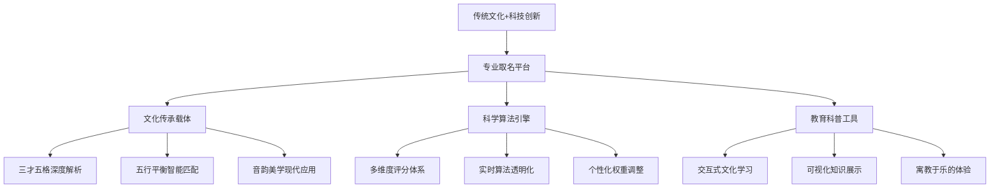
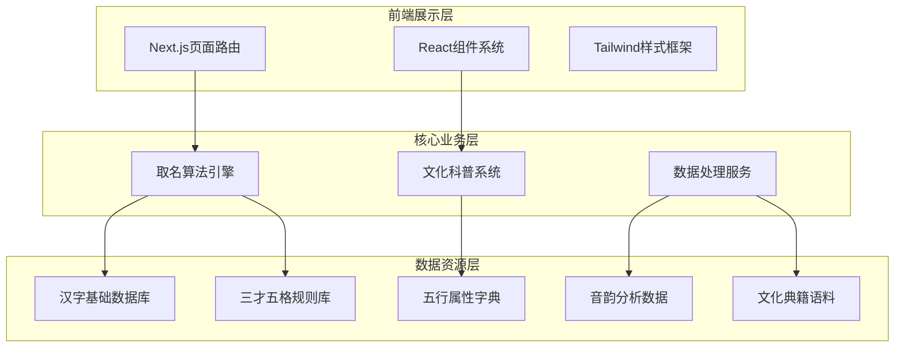

# 🚀 Child_Name项目2024年设计与实现逻辑更新方案

## 📊 **当前项目分析总结**

### ✅ **已实现的核心功能**
1. **传统文化展示体系** - 首页红框区域，三大科普模块
2. **完整科普功能体系** - 三个专业弹窗组件(StrokeAnalysis、WuxingAnalysis、SancaiCalculation)
3. **基础取名界面** - 性别选择、姓氏输入、快速生成
4. **响应式设计** - 桌面端和移动端适配
5. **Next.js架构** - 现代化前端技术栈

### 🔍 **当前架构优势**
- **文化教育价值** - 独特的传统文化科普功能
- **算法透明度** - 详细的计算过程展示
- **用户体验** - 现代化的界面设计
- **技术先进性** - Next.js + TypeScript + Tailwind CSS

### ⚠️ **发现的改进空间**
1. **功能完整性** - 核心取名算法需要进一步完善
2. **数据集成度** - 需要更好地整合参考项目的数据资源
3. **用户流程** - 从输入到结果的完整体验链路
4. **性能优化** - 大数据量处理和加载优化

---

## 🎯 **2024年更新设计理念**

### 1. **产品定位升级**


### 2. **核心价值主张重新定义**
- **🎓 文化教育领先** - 行业唯一的深度文化科普功能
- **🔬 算法科学透明** - 完全开放的计算逻辑和评分依据
- **🎨 体验设计创新** - 现代化UI与传统文化的完美融合
- **⚡ 技术实现先进** - 纯前端架构，快速响应，隐私保护

---

## 🏗️ **更新后的技术架构设计**

### 1. **整体架构图**


### 2. **数据架构优化**
基于对参考项目的分析，整合最优质的数据资源：

```typescript
// 数据资源整合方案
interface DataArchitecture {
  // 来自chinese-dictionary项目
  characterBase: {
    chars: 20000,      // 汉字基础信息
    details: 20000,    // 详细解释
    polyphones: 2495   // 多音字
  },
  
  // 来自Chinese-Names-Corpus项目
  nameCorpus: {
    modern: 1200000,   // 现代中文人名
    ancient: 250000,   // 古代人名
    surnames: 1000     // 姓氏数据
  },
  
  // 来自qiming/qiming_new项目
  namingAlgorithms: {
    sancaiWuge: true,  // 三才五格计算
    wuxingBalance: true, // 五行平衡
    strokeAnalysis: true // 笔画分析
  },
  
  // 来自gushi_namer项目
  culturalContent: {
    poems: true,       // 古诗词库
    classics: true,    // 经典文献
    literature: true   // 文学作品
  }
}
```

### 3. **核心功能模块重构**

#### 🎯 **智能取名引擎2.0**
```typescript
interface NameGenerationEngine {
  // 多算法融合
  algorithms: {
    sancaiWuge: SancaiWugeCalculator,    // 三才五格
    wuxingBalance: WuxingBalanceAnalyzer, // 五行平衡
    phoneticHarmony: PhoneticAnalyzer,   // 音韵美学
    culturalMeaning: MeaningScorer,      // 文化寓意
    socialPopularity: PopularityAnalyzer  // 社会流行度
  },
  
  // 智能权重系统
  weightSystem: {
    userCustomizable: true,    // 用户可调整
    contextAware: true,        // 场景感知
    learningCapable: true      // 学习用户偏好
  },
  
  // 结果优化
  optimization: {
    multiObjective: true,      // 多目标优化
    diversityEnsurance: true,  // 确保多样性
    qualityFiltering: true     // 质量过滤
  }
}
```

#### 📚 **文化科普系统2.0**
基于现有的三大弹窗组件，进一步扩展：

```typescript
interface CulturalEducationSystem {
  // 现有模块升级
  existingModules: {
    strokeAnalysis: "升级到交互式计算器",
    wuxingAnalysis: "添加实时五行平衡演示",
    sancaiCalculation: "集成可视化计算过程"
  },
  
  // 新增模块
  newModules: {
    phoneticBeauty: "音韵美学深度解析",
    historicalNames: "历史名人姓名文化",
    regionalTraditions: "地域取名传统",
    modernTrends: "现代取名趋势分析"
  },
  
  // 交互增强
  interactivity: {
    realTimeCalculation: true,  // 实时计算演示
    stepByStepGuide: true,     // 分步骤引导
    gamification: true,        // 游戏化学习
    progressTracking: true     // 学习进度跟踪
  }
}
```

---

## 🎨 **用户体验设计更新**

### 1. **用户流程优化**


### 2. **界面设计升级**
- **🎨 视觉层次优化** - 更清晰的信息架构
- **🎯 交互流程简化** - 减少操作步骤，提升效率
- **📱 移动端体验增强** - 触屏友好的操作设计
- **🎪 动画效果添加** - 提升视觉吸引力和反馈感

### 3. **个性化体验设计**
```typescript
interface PersonalizationFeatures {
  userPreferences: {
    culturalOrientation: "传统 | 现代 | 融合",
    weightPriority: "文化寓意 | 音韵美感 | 数理吉凶",
    resultStyle: "详细分析 | 简洁推荐 | 对比展示"
  },
  
  adaptiveInterface: {
    experienceLevel: "新手引导 | 专家模式",
    learningPath: "基础科普 | 深度研究",
    interactionStyle: "探索发现 | 目标导向"
  },
  
  socialFeatures: {
    familyCollaboration: "家庭成员协作取名",
    expertConsultation: "专家建议和点评",
    communitySharing: "分享经验和心得"
  }
}
```

---

## 🚀 **功能实现路线图**

### 阶段一：核心功能完善 (4-6周)
- [ ] **取名算法引擎完整实现**
  - 集成qiming项目的三才五格算法
  - 实现五行平衡计算逻辑
  - 添加音韵美学分析功能
  
- [ ] **数据集成和优化**
  - 整合chinese-dictionary的汉字数据
  - 导入Chinese-Names-Corpus的名字语料
  - 优化数据加载和缓存策略

- [ ] **用户流程完善**
  - 完整的输入验证和引导
  - 实时计算和结果展示
  - 详细的分析报告生成

### 阶段二：体验优化升级 (3-4周)
- [ ] **文化科普系统增强**
  - 现有弹窗组件功能扩展
  - 添加交互式计算演示
  - 集成更多文化内容模块

- [ ] **个性化功能开发**
  - 用户偏好设置系统
  - 权重自定义功能
  - 学习轨迹追踪

- [ ] **性能和体验优化**
  - 加载速度优化
  - 动画效果添加
  - 移动端体验提升

### 阶段三：高级功能扩展 (4-5周)
- [ ] **社交协作功能**
  - 家庭成员协作取名
  - 结果分享和讨论
  - 专家点评系统

- [ ] **智能推荐系统**
  - 基于用户行为的个性化推荐
  - 相似用户的取名偏好分析
  - 流行趋势预测

- [ ] **高级分析工具**
  - 名字流行度分析
  - 地域文化适配
  - 时代背景关联

---

## 📊 **技术实现细节**

### 1. **算法引擎实现**
```typescript
// 核心算法引擎架构
class AdvancedNameGenerator {
  private calculators: {
    sancai: SancaiWugeCalculator,
    wuxing: WuxingBalanceAnalyzer,
    phonetic: PhoneticHarmonyAnalyzer,
    meaning: CulturalMeaningScorer,
    popularity: SocialPopularityAnalyzer
  };
  
  private weightSystem: AdaptiveWeightSystem;
  private dataLoader: UnifiedDataLoader;
  
  async generateNames(config: NameGenerationConfig): Promise<EnhancedNameResult[]> {
    // 1. 数据预加载和验证
    await this.dataLoader.preloadRequiredData(config);
    
    // 2. 多算法并行计算
    const results = await Promise.all([
      this.calculators.sancai.calculate(config),
      this.calculators.wuxing.analyze(config),
      this.calculators.phonetic.evaluate(config),
      this.calculators.meaning.score(config),
      this.calculators.popularity.assess(config)
    ]);
    
    // 3. 智能权重融合
    const weightedScores = this.weightSystem.combineScores(results, config.weights);
    
    // 4. 结果优化和排序
    return this.optimizeAndRankResults(weightedScores, config);
  }
}
```

### 2. **数据管理策略**
```typescript
// 统一数据加载器
class UnifiedDataLoader {
  private cacheManager: IntelligentCacheManager;
  private dataIndexer: OptimizedDataIndexer;
  
  async loadCharacterData(): Promise<CharacterDatabase> {
    // 智能分片加载，优先加载常用字
    return await this.cacheManager.getOrLoad('characters', async () => {
      const commonChars = await this.loadCommonCharacters();
      const extendedChars = await this.loadExtendedCharacters();
      return this.dataIndexer.createSearchableIndex({ commonChars, extendedChars });
    });
  }
  
  async loadCulturalContent(): Promise<CulturalContentLibrary> {
    // 按需加载文化内容，支持懒加载
    return await this.cacheManager.getOrLoad('cultural', async () => {
      return {
        poems: await this.loadPoetryDatabase(),
        classics: await this.loadClassicalTexts(),
        stories: await this.loadCulturalStories()
      };
    });
  }
}
```

### 3. **组件架构升级**
```typescript
// 增强型组件系统
interface EnhancedComponentSystem {
  // 智能表单组件
  smartForm: {
    component: "IntelligentNameForm",
    features: ["实时验证", "智能提示", "渐进式填写"],
    validation: "多层次验证逻辑"
  },
  
  // 可视化展示组件
  visualization: {
    components: ["RadarChart", "ProgressRing", "FlowDiagram"],
    interactivity: "点击钻取，悬停提示",
    responsiveness: "多设备适配"
  },
  
  // 科普教育组件
  education: {
    existing: ["StrokeAnalysis", "WuxingAnalysis", "SancaiCalculation"],
    enhanced: ["交互式计算器", "动画演示", "进度跟踪"],
    new: ["PhoneticBeauty", "HistoricalContext", "ModernTrends"]
  }
}
```

---

## 🎯 **预期成果和价值**

### 1. **用户价值提升**
- **学习价值** - 深度了解传统文化，提升文化素养
- **决策支持** - 科学透明的分析，帮助做出最佳选择  
- **体验享受** - 现代化界面，流畅的操作体验
- **个性满足** - 高度定制化，满足不同需求

### 2. **产品竞争优势**
- **技术领先** - 最先进的纯前端取名解决方案
- **文化深度** - 行业最完善的传统文化科普体系
- **算法透明** - 完全开放的计算逻辑，建立用户信任
- **体验创新** - 传统文化与现代技术的完美融合

### 3. **市场定位强化**
- **专业性** - 成为取名领域的技术和文化标杆
- **教育性** - 建立传统文化传播的数字化平台
- **创新性** - 开创算法透明化的行业新标准
- **可信度** - 通过科普教育建立品牌权威性

---

## 📋 **下一步行动计划**

### 立即执行 (本周)
1. **核心算法集成** - 从参考项目中提取核心算法逻辑
2. **数据资源整理** - 评估和准备所需的数据文件
3. **组件功能增强** - 升级现有的科普弹窗组件

### 短期目标 (1-2周)
1. **完整取名流程** - 实现从输入到结果的完整用户体验
2. **性能优化** - 优化数据加载和计算效率
3. **界面美化** - 提升视觉设计和交互体验

### 中期目标 (1个月)
1. **个性化功能** - 实现用户偏好设置和权重调整
2. **高级分析** - 添加更深层次的文化和统计分析
3. **社交功能** - 开发协作和分享功能

这个更新方案将child_name项目提升到一个全新的水平，既保持了现有的文化教育特色，又大幅增强了实用性和用户体验。通过整合参考项目的优秀算法和数据资源，我们将创造出一个真正领先的专业取名平台！🚀