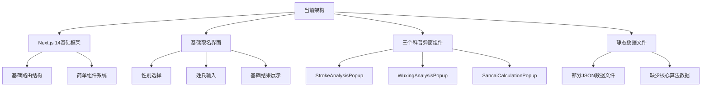
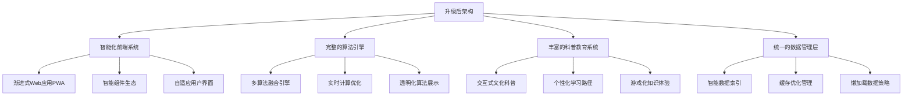
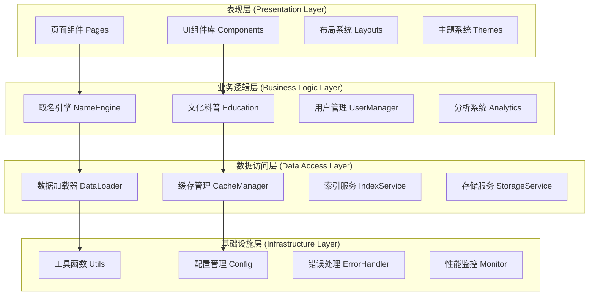
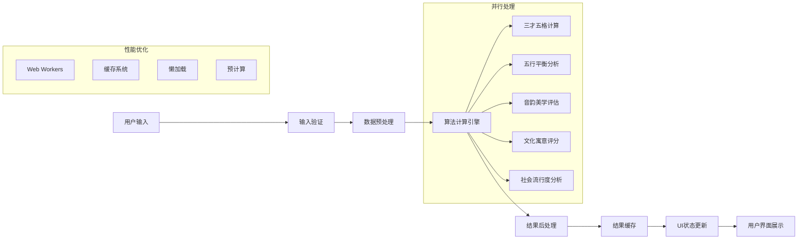

# 🏗️ Child_Name项目技术架构升级方案

## 🎯 **架构升级目标**

### 当前架构分析


### 升级后目标架构


---

## 🔧 **核心技术栈升级**

### 1. **前端框架增强**
```typescript
// 当前技术栈
interface CurrentTechStack {
  framework: "Next.js 14";
  language: "TypeScript";
  styling: "Tailwind CSS";
  state: "React useState";
  routing: "Next.js Pages";
}

// 升级后技术栈
interface UpgradedTechStack extends CurrentTechStack {
  // 状态管理升级
  stateManagement: "Zustand + React Query";
  
  // 性能优化
  optimization: {
    bundling: "Webpack 5 + Module Federation",
    caching: "SWR + IndexedDB",
    compression: "Brotli + Gzip",
    cdnIntegration: "智能CDN资源分发"
  };
  
  // 用户体验增强
  uxEnhancement: {
    animations: "Framer Motion",
    charts: "Recharts + D3.js",
    gestures: "React Use Gesture",
    accessibility: "React A11y"
  };
  
  // 开发工具升级
  devTools: {
    testing: "Vitest + React Testing Library",
    e2e: "Playwright",
    linting: "ESLint + Prettier + Husky",
    monitoring: "Sentry + Web Vitals"
  };
}
```

### 2. **数据架构重构**
```typescript
// 统一数据管理架构
interface DataArchitecture {
  // 数据层次结构
  layers: {
    storage: "IndexedDB + Memory Cache",
    access: "Optimized Data Access Layer", 
    processing: "Data Processing Pipeline",
    presentation: "View Model Layer"
  };
  
  // 数据源整合
  dataSources: {
    characters: "chinese-dictionary数据库",
    names: "Chinese-Names-Corpus语料库",
    algorithms: "qiming/qiming_new算法库",
    cultural: "gushi_namer文化内容库"
  };
  
  // 索引优化
  indexing: {
    search: "全文搜索索引",
    filter: "多维度过滤索引",
    sort: "排序优化索引",
    cache: "智能缓存索引"
  };
}
```

### 3. **模块化架构设计**


---

## 🚀 **性能优化架构**

### 1. **加载性能优化**
```typescript
// 智能资源加载策略
class IntelligentResourceLoader {
  // 关键资源优先加载
  async loadCriticalResources(): Promise<void> {
    const criticalData = await Promise.all([
      this.loadCoreAlgorithms(),     // 核心算法 <100KB
      this.loadCommonCharacters(),   // 常用字库 <200KB
      this.loadBasicRules(),         // 基础规则 <50KB
      this.loadUIAssets()            // UI资源 <300KB
    ]);
    
    // 总计 <650KB，目标 <1秒加载完成
    this.initializeApp(criticalData);
  }
  
  // 次要资源按需加载
  async loadSecondaryResources(): Promise<void> {
    // 用户交互时触发加载
    const lazyData = await Promise.all([
      this.loadExtendedCharacters(), // 扩展字库 <2MB
      this.loadCulturalContent(),    // 文化内容 <1MB
      this.loadAdvancedFeatures()    // 高级功能 <500KB
    ]);
    
    // 后台预加载，不影响用户体验
    this.enhanceApp(lazyData);
  }
}
```

### 2. **计算性能优化**
```typescript
// 多线程计算架构
interface ComputationArchitecture {
  // 主线程：UI响应和轻量计算
  mainThread: {
    responsibilities: [
      "用户界面更新",
      "基础验证逻辑", 
      "结果展示处理"
    ];
    maxComputationTime: "16ms"; // 保持60FPS
  };
  
  // Web Workers：重计算任务
  webWorkers: {
    sancaiWorker: "三才五格计算专用线程",
    wuxingWorker: "五行分析计算线程",
    dataWorker: "数据处理和索引线程",
    cacheWorker: "缓存管理专用线程"
  };
  
  // SharedArrayBuffer：高效数据共享
  sharedMemory: {
    characterData: "共享汉字数据",
    algorithmCache: "算法结果缓存",
    userPreferences: "用户偏好数据"
  };
}
```

### 3. **缓存策略优化**
```typescript
// 多层缓存架构
class MultiLayerCacheSystem {
  // L1: 内存缓存 (最快访问)
  private memoryCache = new Map<string, any>();
  
  // L2: IndexedDB (持久化本地存储)
  private persistentCache: IDBDatabase;
  
  // L3: Service Worker (网络资源缓存)
  private serviceWorkerCache: Cache;
  
  async get(key: string): Promise<any> {
    // 缓存层级查找
    return (
      this.memoryCache.get(key) ||
      await this.persistentCache.get(key) ||
      await this.serviceWorkerCache.match(key) ||
      await this.fetchAndCache(key)
    );
  }
  
  // 智能缓存更新策略
  async updateCache(key: string, data: any): Promise<void> {
    // 同时更新所有缓存层
    this.memoryCache.set(key, data);
    await this.persistentCache.put(key, data);
    await this.serviceWorkerCache.put(key, new Response(data));
  }
}
```

---

## 🎨 **用户界面架构升级**

### 1. **组件系统重构**
```typescript
// 原子化设计系统
interface AtomicDesignSystem {
  // 原子组件 (Atoms)
  atoms: {
    Button: "可配置的按钮组件",
    Input: "智能输入框组件", 
    Icon: "SVG图标组件",
    Typography: "文本样式组件"
  };
  
  // 分子组件 (Molecules)  
  molecules: {
    FormField: "表单字段组合",
    SearchBox: "搜索框组合",
    ScoreCard: "评分卡片组合",
    ProgressIndicator: "进度指示器组合"
  };
  
  // 有机体组件 (Organisms)
  organisms: {
    NavigationHeader: "导航头部",
    NameGenerationForm: "取名表单",
    ResultsDashboard: "结果仪表板",
    EducationPanel: "科普教育面板"
  };
  
  // 模板 (Templates)
  templates: {
    PageLayout: "页面布局模板",
    FormLayout: "表单布局模板", 
    DashboardLayout: "仪表板布局模板"
  };
  
  // 页面 (Pages)
  pages: {
    HomePage: "首页",
    GenerationPage: "取名页面",
    ResultsPage: "结果页面",
    EducationPage: "教育页面"
  };
}
```

### 2. **响应式设计架构**
```typescript
// 自适应布局系统
class AdaptiveLayoutSystem {
  breakpoints = {
    xs: '320px',   // 小型手机
    sm: '576px',   // 大型手机
    md: '768px',   // 平板竖屏
    lg: '992px',   // 平板横屏/小笔记本
    xl: '1200px',  // 桌面显示器
    xxl: '1600px'  // 大屏显示器
  };
  
  // 组件级响应式配置
  getComponentConfig(component: string, screenSize: string): ComponentConfig {
    const configs = {
      'NameGenerationForm': {
        xs: { columns: 1, spacing: 'compact' },
        md: { columns: 2, spacing: 'normal' }, 
        xl: { columns: 3, spacing: 'comfortable' }
      },
      'ResultsDashboard': {
        xs: { layout: 'stack', cards: 1 },
        md: { layout: 'grid', cards: 2 },
        xl: { layout: 'grid', cards: 3 }
      }
    };
    
    return configs[component][screenSize];
  }
}
```

### 3. **交互动画系统**
```typescript
// 动画配置系统
interface AnimationSystem {
  // 微交互动画
  microInteractions: {
    buttonHover: "按钮悬停效果",
    inputFocus: "输入框焦点动画", 
    cardHover: "卡片悬停反馈",
    loadingStates: "加载状态动画"
  };
  
  // 页面转场动画
  pageTransitions: {
    fadeIn: "淡入效果",
    slideUp: "上滑效果",
    zoomIn: "缩放进入",
    morphing: "形态变换"
  };
  
  // 数据可视化动画
  dataAnimations: {
    chartRendering: "图表渲染动画",
    progressUpdate: "进度更新动画",
    scoreReveal: "分数揭示动画",
    comparison: "对比展示动画"
  };
  
  // 性能优化
  performance: {
    useGPUAcceleration: true,
    reducedMotionSupport: true,
    frameRateOptimization: true,
    memoryEfficiency: true
  };
}
```

---

## 📊 **数据流架构设计**

### 1. **状态管理架构**
```typescript
// Zustand + React Query 状态管理
interface StateManagementArchitecture {
  // 全局状态 (Zustand)
  globalState: {
    userPreferences: "用户偏好设置",
    applicationConfig: "应用配置",
    cacheStatus: "缓存状态",
    performanceMetrics: "性能指标"
  };
  
  // 服务器状态 (React Query)
  serverState: {
    characterData: "汉字数据查询",
    algorithmResults: "算法计算结果",
    culturalContent: "文化内容",
    userGeneratedContent: "用户生成内容"
  };
  
  // 组件本地状态 (useState)
  localState: {
    formInputs: "表单输入状态",
    uiInteractions: "UI交互状态",
    temporaryData: "临时数据",
    componentSpecific: "组件特定状态"
  };
}
```

### 2. **数据流管道设计**


### 3. **错误处理和监控**
```typescript
// 错误处理和监控系统
class ErrorHandlingAndMonitoring {
  // 错误边界组件
  errorBoundaries = {
    GlobalErrorBoundary: "全局错误捕获",
    FeatureErrorBoundary: "功能模块错误隔离",
    AsyncErrorBoundary: "异步操作错误处理"
  };
  
  // 性能监控
  performanceMonitoring = {
    webVitals: "Core Web Vitals监控",
    userInteractions: "用户交互性能",
    resourceLoading: "资源加载性能",
    algorithmPerformance: "算法执行性能"
  };
  
  // 用户体验监控
  uxMonitoring = {
    userJourney: "用户路径追踪",
    featureUsage: "功能使用统计",
    satisfactionMetrics: "满意度指标",
    accessibilityCompliance: "无障碍合规性"
  };
}
```

---

## 🛡️ **安全和隐私架构**

### 1. **客户端安全策略**
```typescript
// 客户端安全实现
interface ClientSideSecurity {
  // 数据保护
  dataProtection: {
    encryption: "敏感数据本地加密",
    sanitization: "输入数据清理",
    validation: "客户端数据验证"
  };
  
  // 隐私保护
  privacyProtection: {
    localProcessing: "所有计算本地执行",
    noDataTransmission: "用户数据不离开设备",
    sessionStorage: "会话级别数据存储",
    userControlledData: "用户可控的数据管理"
  };
  
  // 内容安全
  contentSecurity: {
    cspHeaders: "内容安全策略",
    xssProtection: "XSS攻击防护",
    sanitizedHTML: "HTML内容清理"
  };
}
```

### 2. **数据隐私合规**
```typescript
// GDPR和隐私法规合规
interface PrivacyCompliance {
  // 数据收集透明度
  dataTransparency: {
    clearPurpose: "明确的数据使用目的",
    minimalCollection: "最小化数据收集",
    userConsent: "明确的用户同意",
    accessControl: "用户数据访问控制"
  };
  
  // 用户权利保障
  userRights: {
    dataAccess: "数据访问权",
    dataPortability: "数据可移植性",
    dataErasure: "数据删除权",
    dataCorrection: "数据更正权"
  };
}
```

---

## 📈 **可扩展性架构设计**

### 1. **模块化扩展架构**
```typescript
// 插件式扩展系统
interface ModularExtensionSystem {
  // 核心模块
  coreModules: {
    nameGeneration: "核心取名功能",
    culturalEducation: "文化科普功能", 
    userInterface: "用户界面系统",
    dataManagement: "数据管理系统"
  };
  
  // 扩展模块
  extensionModules: {
    advancedAnalytics: "高级分析模块",
    socialFeatures: "社交功能模块",
    expertSystem: "专家系统模块",
    gamification: "游戏化模块"
  };
  
  // 第三方集成
  thirdPartyIntegrations: {
    paymentSystems: "支付系统集成",
    socialPlatforms: "社交平台集成",
    analyticsServices: "分析服务集成",
    cloudServices: "云服务集成"
  };
}
```

### 2. **国际化架构**
```typescript
// 多语言和本地化支持
interface InternationalizationArchitecture {
  // 语言支持
  languages: {
    primary: "zh-CN (简体中文)",
    secondary: ["zh-TW (繁体中文)", "en-US (英语)"],
    future: ["ja-JP (日语)", "ko-KR (韩语)"]
  };
  
  // 文化适配
  culturalAdaptation: {
    namingTraditions: "不同文化的取名传统",
    linguisticFeatures: "语言特性适配",
    culturalSymbols: "文化符号本地化",
    regionalPreferences: "地域偏好设置"
  };
  
  // 技术实现
  technicalImplementation: {
    i18nFramework: "react-i18next",
    localeData: "ICU消息格式",
    rtlSupport: "RTL语言支持",
    fontOptimization: "字体优化加载"
  };
}
```

---

## 🎯 **实施路线图**

### 阶段1：基础架构升级 (2-3周)
1. **状态管理重构** - 引入Zustand + React Query
2. **数据层重构** - 统一数据访问接口
3. **组件系统升级** - 原子化设计实现
4. **性能基础优化** - 缓存和懒加载

### 阶段2：功能模块增强 (3-4周)
1. **算法引擎完善** - 多算法融合
2. **科普系统升级** - 交互性增强
3. **可视化系统开发** - 图表和动画
4. **用户体验优化** - 响应式和无障碍

### 阶段3：高级特性开发 (2-3周)
1. **个性化系统** - 智能推荐
2. **监控和分析** - 性能和用户行为
3. **安全和隐私** - 合规性实现
4. **可扩展性准备** - 模块化架构

### 阶段4：测试和部署 (1-2周)
1. **全面测试** - 单元、集成、E2E测试
2. **性能调优** - 最终性能优化
3. **部署准备** - CI/CD和发布策略
4. **文档完善** - 技术和用户文档

这个技术架构升级方案将为child_name项目提供坚实的技术基础，确保项目能够支撑复杂的功能需求，同时保持优秀的性能和用户体验！🚀