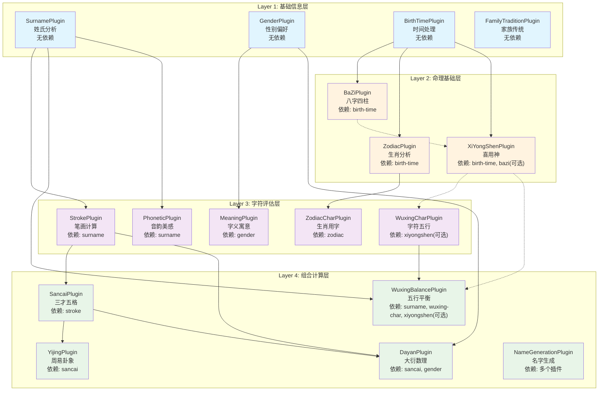

# 插件系统层级划分分析报告

## 📊 概述

本报告深入分析了宝宝取名系统的插件化架构，重点评估当前四层级插件体系的设计原理、依赖关系、确定性等级管理机制，并提出优化建议。

> 📘 **插件详细说明**：每个插件的具体功能、输入输出格式和数据流向详见 [确定性等级插件详细说明](./确定性等级插件详细说明.md)

## 🏗️ 当前架构分析

### 四层级插件体系



### 层级划分原理

#### 1. **数据流向和处理阶段**
- **Layer 1 (基础信息层)**：收集和标准化原始输入数据
- **Layer 2 (命理基础层)**：基于基础数据进行传统命理计算
- **Layer 3 (字符评估层)**：对候选字符进行多维度评估
- **Layer 4 (组合计算层)**：综合前面结果进行最终评分和生成

#### 2. **依赖复杂度递增**
```
Layer 1: 无依赖 → Layer 2: 单依赖 → Layer 3: 跨层依赖 → Layer 4: 多依赖聚合
```

#### 3. **确定性需求差异**
- Layer 1-2：对数据完整性敏感度高
- Layer 3-4：可以基于部分数据进行估算

## ✅ 现有设计的优势

### 1. **符合传统取名逻辑**
- 先确定基础信息 → 分析命理基础 → 评估字符 → 组合计算
- 这个流程符合传统命名师的思维过程

### 2. **依赖关系清晰**
- 单向依赖，避免循环依赖
- 层级间的数据流向明确

### 3. **并行执行优化**
- 同层级插件可以并行执行
- 有效提升性能（30-50%性能改善）

### 4. **模块化程度高**
- 插件可独立开发和测试
- 支持热插拔和动态加载

## ⚠️ 发现的问题

### 1. **层级划分不够严格**

**问题描述：**
```typescript
// 发现的跨层级依赖问题：
Layer 3 的 MeaningPlugin 只依赖 Layer 1 的 gender
Layer 3 的 WuxingCharPlugin 可选依赖 Layer 2 的 xiyongshen
Layer 4 的 WuxingBalancePlugin 直接依赖 Layer 1 的 surname
```

**影响：**
- 违反了层级间的抽象原则
- 可能导致依赖关系混乱
- 影响系统的可维护性

### 2. **确定性等级配置不一致**

**问题描述：**
```typescript
// TruePluginEngine.ts 中的配置与 CertaintyLevelManager.ts 不一致

// TruePluginEngine: Level 1 = 15个插件
FULLY_DETERMINED: [
  'surname', 'gender', 'birth-time', 'family-tradition',
  'bazi', 'zodiac', 'xiyongshen',
  'stroke', 'wuxing-char', 'zodiac-char', 'meaning', 'phonetic',
  'sancai', 'dayan', 'name-generation'
]

// CertaintyLevelManager: Level 1 = 15个插件（不包含family-tradition，包含其他）
FULLY_DETERMINED: [
  'surname', 'gender', 'birth-time',
  'bazi', 'zodiac', 'xiyongshen',
  'stroke', 'wuxing-char', 'zodiac-char', 'meaning', 'phonetic',
  'sancai', 'yijing', 'dayan', 'wuxing-balance'
]
```

**影响：**
- 系统行为不一致
- 调试困难
- 可能导致运行时错误

### 3. **缺乏智能降级机制**

**问题描述：**
- 当某个插件失败时，没有合理的降级策略
- 依赖链断裂时处理不够优雅
- 缺少软依赖管理

**影响：**
- 系统鲁棒性不足
- 用户体验可能受影响
- 故障恢复能力有限

## 🎯 优化建议

### 1. **重新定义层级划分标准**

建议将现有的"处理阶段"划分调整为"数据依赖程度"划分：

```typescript
// 建议的新层级标准
Layer 0: 数据验证层 (Data Validation)
- 数据清洗、格式验证、完整性检查
- 插件：DataValidationPlugin, FormatNormalizationPlugin

Layer 1: 原子数据层 (Atomic Data)  
- 单一数据源，无依赖的基础分析
- 插件：surname, gender, birth-time

Layer 2: 派生计算层 (Derived Calculation)
- 基于Layer 1进行的复杂计算
- 插件：bazi, zodiac, xiyongshen

Layer 3: 评估分析层 (Evaluation Analysis)
- 基于Layer 1-2进行字符级评估
- 插件：stroke, meaning, phonetic, wuxing-char, zodiac-char

Layer 4: 综合决策层 (Comprehensive Decision)
- 聚合多层数据的最终计算
- 插件：sancai, dayan, wuxing-balance, yijing

Layer 5: 结果生成层 (Result Generation)
- 基于所有分析结果生成最终名字
- 插件：name-generation
```

### 2. **优化确定性等级管理**

```typescript
// 建议的新确定性等级策略
interface CertaintyStrategy {
  level: CertaintyLevel;
  enabledLayers: number[];  // 启用的层级
  fallbackRules: {
    missingData: string[];
    alternativePlugins: string[];
    estimationMethod: string;
  };
  qualityThreshold: number;
}

const CERTAINTY_STRATEGIES = {
  FULLY_DETERMINED: {
    level: 1,
    enabledLayers: [0, 1, 2, 3, 4, 5],
    requiresPlugins: ['birth-time', 'bazi'],
    requiredData: ['familyName', 'gender', 'birthInfo.year', 'birthInfo.month', 'birthInfo.day', 'birthInfo.hour'],
    fallbackRules: {
      missingData: [],
      alternativePlugins: [],
      estimationMethod: 'none'
    },
    qualityThreshold: 0.9
  },
  
  PARTIALLY_DETERMINED: {
    level: 2, 
    enabledLayers: [0, 1, 2, 3, 4, 5],
    requiresPlugins: ['birth-time'],
    skipPlugins: ['yijing'], // 跳过对时辰精度要求高的插件
    requiredData: ['familyName', 'gender', 'birthInfo.year', 'birthInfo.month', 'birthInfo.day'],
    fallbackRules: {
      missingData: ['birthInfo.hour'],
      alternativePlugins: ['simplified-bazi'],
      estimationMethod: 'probabilistic'
    },
    qualityThreshold: 0.8
  },
  
  ESTIMATED: {
    level: 3,
    enabledLayers: [0, 1, 3, 4, 5], // 跳过Layer 2(命理基础层)
    estimationPlugins: ['zodiac-estimated'],
    requiredData: ['familyName', 'gender', 'predueDate.year', 'predueDate.month'],
    fallbackRules: {
      missingData: ['birthInfo'],
      alternativePlugins: ['generic-zodiac', 'conservative-wuxing'],
      estimationMethod: 'conservative-estimation'
    },
    qualityThreshold: 0.6
  },
  
  UNKNOWN: {
    level: 4,
    enabledLayers: [0, 1, 3, 5], // 仅基础+评估+生成
    conservativeMode: true,
    requiredData: ['familyName', 'gender'],
    fallbackRules: {
      missingData: ['birthInfo', 'predueDate'],
      alternativePlugins: ['traditional-calculation'],
      estimationMethod: 'traditional-analysis'
    },
    qualityThreshold: 0.5
  }
};
```

### 3. **引入智能降级机制**

```typescript
// 建议的降级策略
interface DegradationStrategy {
  triggerConditions: string[];
  actions: {
    disablePlugins?: string[];
    substitutePlugins?: { [key: string]: string };
    adjustConfidence?: number;
    enableFallback?: boolean;
  };
  impactAssessment: {
    affectedFeatures: string[];
    qualityReduction: number;
    userNotification: string;
  };
}

const DEGRADATION_STRATEGIES = {
  MISSING_BIRTH_TIME: {
    triggerConditions: ['birth-time.failed', 'birth-time.incomplete'],
    actions: {
      disablePlugins: ['bazi', 'yijing'],
      substitutePlugins: {
        'zodiac': 'zodiac-estimated',
        'xiyongshen': 'generic-wuxing-balance'
      },
      adjustConfidence: 0.7,
      enableFallback: true
    },
    impactAssessment: {
      affectedFeatures: ['八字分析', '周易卦象'],
      qualityReduction: 0.2,
      userNotification: '缺少出生时间，已切换到预估模式'
    }
  },
  
  PLUGIN_FAILURE: {
    triggerConditions: ['plugin.crashed', 'plugin.timeout'],
    actions: {
      disablePlugins: ['failed-plugin'],
      substitutePlugins: {},
      adjustConfidence: 0.8,
      enableFallback: true
    },
    impactAssessment: {
      affectedFeatures: ['相关分析功能'],
      qualityReduction: 0.1,
      userNotification: '某些分析功能暂时不可用，已启用备用方案'
    }
  }
};
```

### 4. **优化依赖关系管理**

建议引入"软依赖"和"强依赖"的概念：

```typescript
interface EnhancedPluginDependency {
  pluginId: string;
  type: 'hard' | 'soft' | 'optional';
  fallbackStrategy?: 'skip' | 'estimate' | 'substitute';
  alternativePlugins?: string[];
  minimumConfidence?: number;
  description?: string;
}

// 示例：增强的依赖定义
const ENHANCED_DEPENDENCIES = {
  'xiyongshen': [
    {
      pluginId: 'birth-time',
      type: 'hard',
      description: '必须有出生时间才能分析喜用神'
    },
    {
      pluginId: 'bazi',
      type: 'soft',
      fallbackStrategy: 'estimate',
      alternativePlugins: ['simplified-wuxing-analysis'],
      minimumConfidence: 0.6,
      description: '优先基于八字分析，如不可用则使用简化五行分析'
    }
  ],
  
  'wuxing-balance': [
    {
      pluginId: 'surname',
      type: 'hard',
      description: '必须有姓氏信息'
    },
    {
      pluginId: 'wuxing-char',
      type: 'soft',
      fallbackStrategy: 'substitute',
      alternativePlugins: ['basic-wuxing-char'],
      description: '优先使用详细字符五行分析，如不可用则使用基础分析'
    },
    {
      pluginId: 'xiyongshen',
      type: 'optional',
      fallbackStrategy: 'skip',
      description: '如果有喜用神分析则使用，否则跳过'
    }
  ]
};
```

## 📋 实施计划

### 短期改进 (1-2周)

1. **修复配置不一致问题**
   - [ ] 统一 `TruePluginEngine` 和 `CertaintyLevelManager` 中的插件配置
   - [ ] 建立单一配置源，避免重复维护
   - [ ] 添加配置验证机制

2. **完善文档**
   - [ ] 更新插件依赖关系文档
   - [ ] 补充确定性等级说明
   - [ ] 添加故障处理指南

### 中期重构 (1-2个月)

1. **实现智能降级机制**
   - [ ] 开发降级策略引擎
   - [ ] 实现插件故障检测
   - [ ] 添加用户友好的错误提示

2. **引入软依赖管理**
   - [ ] 扩展依赖关系定义
   - [ ] 实现替代插件机制
   - [ ] 优化插件选择算法

3. **优化确定性等级**
   - [ ] 重新设计确定性策略
   - [ ] 实现动态等级调整
   - [ ] 添加质量评估指标

### 长期优化 (3-6个月)

1. **层级结构重构**
   - [ ] 引入Layer 0（数据验证层）
   - [ ] 引入Layer 5（结果生成层）
   - [ ] 重新组织现有插件

2. **智能化改进**
   - [ ] 实现机器学习优化插件选择
   - [ ] 动态调整插件权重
   - [ ] 用户行为驱动的个性化配置

3. **性能优化**
   - [ ] 优化并行执行策略
   - [ ] 实现插件结果缓存
   - [ ] 添加性能监控和分析

## 📊 预期收益

### 质量改进
- **一致性提升**：消除配置不一致问题，提高系统可靠性
- **鲁棒性增强**：通过降级机制提高故障容错能力
- **用户体验优化**：更智能的确定性等级管理，提供更好的交互体验

### 开发效率
- **维护成本降低**：更清晰的层级划分，降低代码复杂度
- **扩展性增强**：标准化的插件接口，便于添加新功能
- **调试效率提升**：更好的错误处理和日志记录

### 性能优化
- **执行效率**：优化的依赖管理和并行执行策略
- **资源利用**：动态插件加载，按需分配计算资源
- **响应速度**：智能缓存和预加载机制

## 🎯 总结

当前的四层级插件划分**基本合理**，符合传统取名的逻辑流程，但在一致性、灵活性和容错能力方面需要改进。通过实施上述优化建议，可以在保持现有架构优势的同时，显著提升系统的稳定性、灵活性和用户体验。

核心改进方向：
1. **一致性**：统一配置，消除不一致问题
2. **智能化**：引入降级机制和软依赖管理
3. **扩展性**：优化层级划分，支持更灵活的插件组合
4. **用户体验**：更智能的确定性等级管理，提供更好的交互体验

这些改进将使插件系统更加稳定、高效和易于维护，为宝宝取名系统的长期发展奠定坚实基础。

---

*报告生成时间：2024-12-19*
*分析范围：插件系统架构、确定性等级管理、依赖关系管理*
*建议优先级：短期修复 > 中期重构 > 长期优化*
