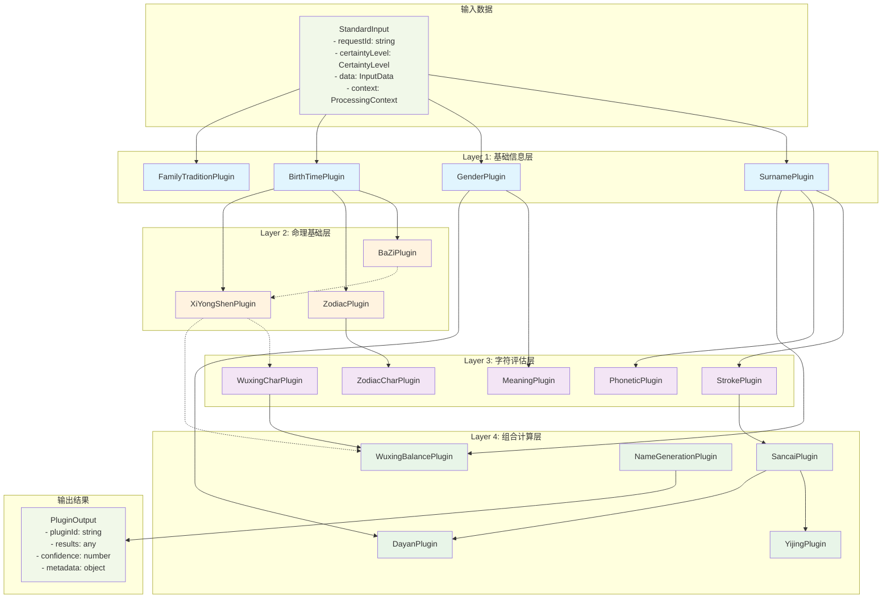

# 确定性等级插件详细说明

## 📋 概述

本文档详细说明宝宝取名系统中四个确定性等级下所涉及的16个插件的数据流向、详细作用、输入输出格式以及依赖关系。

## 🔢 确定性等级概览

| 等级 | 描述 | 启用插件数 | 核心特征 |
|------|------|------------|----------|
| Level 1 (FULLY_DETERMINED) | 完整出生时间 | 15个 | 全功能分析，最高精度 |
| Level 2 (PARTIALLY_DETERMINED) | 缺少具体时辰 | 13个 | 概率分析，智能降级 |
| Level 3 (ESTIMATED) | 仅预产期 | 9个 | 保守估算，风险控制 |
| Level 4 (UNKNOWN) | 基础信息 | 6个 | 传统算法，稳定可靠 |

## 📊 数据流向总览



## 🏗️ Layer 1: 基础信息层 (4个插件)

### 1. SurnamePlugin (姓氏分析插件)

**🎯 作用**：分析姓氏的笔画数、五行属性、百家姓排名等基础信息

**📥 输入**：
```typescript
interface SurnameInput {
  familyName: string;  // 姓氏，如"王"、"李"、"欧阳"
}
```

**📤 输出**：
```typescript
interface SurnameOutput {
  familyName: string;           // 标准化姓氏
  strokes: number;              // 简体笔画数
  strokesTraditional: number;   // 繁体笔画数
  wuxing: string;              // 五行属性
  isSingleChar: boolean;        // 是否单字姓
  isCompoundSurname: boolean;   // 是否复姓
  baijiaxingRank: number;      // 百家姓排名
  metadata: {
    source: string;             // 数据来源
    confidence: number;         // 置信度
    isCommon: boolean;          // 是否常见姓氏
  };
}
```

**🔗 依赖关系**：无依赖
**⚙️ 确定性等级**：全部等级 (1-4)

---

### 2. GenderPlugin (性别分析插件)

**🎯 作用**：分析性别偏好，提供性别相关的命名建议和字符偏好

**📥 输入**：
```typescript
interface GenderInput {
  gender: 'male' | 'female';
}
```

**📤 输出**：
```typescript
interface GenderOutput {
  gender: 'male' | 'female';
  preferences: {
    characterTypes: string[];     // 偏好的字符类型
    semanticFields: string[];     // 语义领域偏好
    culturalTraits: string[];     // 文化特质
  };
  recommendations: string[];      // 命名建议
  commonCharacters: string[];     // 常用字符
  avoidedCharacters: string[];    // 避免字符
  culturalBackground: {
    traditional: string[];        // 传统文化背景
    modern: string[];            // 现代文化背景
  };
  namingStyle: string;           // 命名风格倾向
}
```

**🔗 依赖关系**：无依赖
**⚙️ 确定性等级**：全部等级 (1-4)

---

### 3. BirthTimePlugin (出生时间分析插件)

**🎯 作用**：分析出生时间信息，支持确定时间和预产期模式，提供时间相关的基础数据

**📥 输入**：
```typescript
interface BirthTimeInput {
  birthInfo?: {           // 确定时间模式
    year: number;
    month: number;
    day?: number;
    hour?: number;
    minute?: number;
  };
  predueDate?: {          // 预产期模式
    year: number;
    month: number;
    weekOffset?: number;  // 预产期前后偏差周数
  };
}
```

**📤 输出**：
```typescript
interface BirthTimeOutput {
  timeInfo: {
    type: 'exact' | 'predue' | 'estimated';
    year: number;
    month: number;
    day?: number;
    hour?: number;
    minute?: number;
    confidence: number;   // 时间确定性
  };
  lunarInfo?: {
    year: string;         // 农历年份
    month: string;        // 农历月份
    day?: string;         // 农历日期
    ganzhi: {
      year: string;       // 年柱干支
      month: string;      // 月柱干支
      day?: string;       // 日柱干支
      hour?: string;      // 时柱干支
    };
  };
  zodiacInfo: {
    primary: string;      // 主要生肖
    alternative?: string; // 备选生肖（跨年情况）
    probability?: number; // 概率（预产期模式）
  };
  seasonInfo: {
    season: string;       // 季节
    characteristics: string[]; // 季节特征
  };
  timeCharacteristics: string[]; // 时间特征
  recommendations: {
    strategy: string;     // 推荐策略
    certaintyLevel: CertaintyLevel;
    useBaziCalculation: boolean;
    useHourAnalysis: boolean;
  };
}
```

**🔗 依赖关系**：无依赖
**⚙️ 确定性等级**：全部等级 (1-4)

---

### 4. FamilyTraditionPlugin (家族传统插件)

**🎯 作用**：处理家族传统和文化背景信息

**📥 输入**：
```typescript
interface FamilyTraditionInput {
  familyTradition?: {
    generationChart?: string[];  // 字辈排行
    familyValues?: string[];     // 家族价值观
    culturalBackground?: string; // 文化背景
    namingPreferences?: string[]; // 命名偏好
  };
}
```

**📤 输出**：
```typescript
interface FamilyTraditionOutput {
  hasGenerationChart: boolean;
  generationRequirements: string[];
  culturalConstraints: string[];
  preferredCharacters: string[];
  avoidedCharacters: string[];
  recommendations: string[];
}
```

**🔗 依赖关系**：无依赖
**⚙️ 确定性等级**：仅 Level 1

---

## 🏗️ Layer 2: 命理基础层 (3个插件)

### 5. BaZiPlugin (八字四柱插件)

**🎯 作用**：基于出生时间计算八字四柱，分析命理基础信息

**📥 输入**：依赖 BirthTimePlugin 的结果

**📤 输出**：
```typescript
interface BaZiOutput {
  year: BaZiPillar;     // 年柱
  month: BaZiPillar;    // 月柱
  day: BaZiPillar;      // 日柱
  hour?: BaZiPillar;    // 时柱（如有）
  
  dayMaster: string;           // 日主
  dayMasterWuxing: string;     // 日主五行
  strongWeak: 'strong' | 'weak' | 'balanced'; // 强弱分析
  usefulGods: string[];        // 用神
  avoidGods: string[];         // 忌神
  
  wuxingCount: {               // 五行统计
    jin: number;
    mu: number;
    shui: number;
    huo: number;
    tu: number;
  };
  
  analysisQuality: 'precise' | 'estimated' | 'probabilistic';
  confidence: number;
}

interface BaZiPillar {
  heavenStem: string;    // 天干
  earthBranch: string;   // 地支
  wuxing: string;        // 五行
  yinyang: 'yin' | 'yang'; // 阴阳
}
```

**🔗 依赖关系**：
- **强依赖**：BirthTimePlugin (必须有出生时间)

**⚙️ 确定性等级**：Level 1-2

---

### 6. ZodiacPlugin (生肖分析插件)

**🎯 作用**：基于出生时间分析生肖信息，提供生肖相关的命名建议

**📥 输入**：依赖 BirthTimePlugin 的结果

**📤 输出**：
```typescript
interface ZodiacOutput {
  primaryZodiac: string;        // 主要生肖
  alternativeZodiac?: string;   // 备选生肖
  probability?: number;         // 生肖概率
  
  characteristics: {
    personality: string[];      // 性格特征
    strengths: string[];        // 优势特质
    weaknesses: string[];       // 弱势特质
    luckyElements: string[];    // 幸运元素
    luckyColors: string[];      // 幸运颜色
  };
  
  compatibility: {
    favorable: string[];        // 相合生肖
    unfavorable: string[];      // 相冲生肖
    neutral: string[];          // 中性生肖
  };
  
  namingGuidelines: {
    preferredRadicals: string[]; // 偏好部首
    avoidedRadicals: string[];   // 避免部首
    preferredCharacters: string[]; // 偏好字符
    avoidedCharacters: string[];   // 避免字符
    namingPrinciples: string[];    // 命名原则
    riskAssessment?: string;       // 风险评估
  };
}
```

**🔗 依赖关系**：
- **强依赖**：BirthTimePlugin (必须有时间信息确定生肖)

**⚙️ 确定性等级**：Level 1-3

---

### 7. XiYongShenPlugin (五行喜用神分析插件)

**🎯 作用**：基于八字或时间信息分析五行喜用神，提供命名的五行指导

**📥 输入**：依赖 BirthTimePlugin 和可选的 BaZiPlugin 结果

**📤 输出**：
```typescript
interface XiYongShenOutput {
  analysis: {
    dayMaster: string;          // 日主
    dayMasterWuxing: string;    // 日主五行
    strongWeak: string;         // 强弱分析
    seasonInfluence: string;    // 季节影响
    
    xiShen: string[];          // 喜神（最需要的五行）
    yongShen: string[];        // 用神（有利的五行）
    jiShen: string[];          // 忌神（不利的五行）
    chouShen: string[];        // 仇神（敌对的五行）
    
    confidence: number;         // 分析置信度
    method: string;            // 分析方法
  };
  
  recommendations: {
    primaryElements: string[];  // 主要推荐五行
    secondaryElements: string[]; // 次要推荐五行
    avoidElements: string[];    // 避免五行
    balanceStrategy: string;    // 平衡策略
    namingPriority: string[];   // 命名优先级
  };
  
  elementAnalysis: Array<{
    element: string;
    current: number;            // 当前强度
    ideal: number;              // 理想强度
    gap: number;                // 差距
    priority: number;           // 优先级
    confidence: number;         // 置信度
  }>;
}
```

**🔗 依赖关系**：
- **强依赖**：BirthTimePlugin (必须有时间信息)
- **软依赖**：BaZiPlugin (优先使用八字分析，如不可用则基于时间估算)

**⚙️ 确定性等级**：Level 1-2

---

## 🏗️ Layer 3: 字符评估层 (5个插件)

### 8. StrokePlugin (笔画计算插件)

**🎯 作用**：计算汉字笔画数，为三才五格计算提供基础数据

**📥 输入**：依赖 SurnamePlugin 的结果和候选字符

**📤 输出**：
```typescript
interface StrokeOutput {
  surnameStrokes: number;       // 姓氏笔画
  characterAnalysis: Array<{
    character: string;
    strokes: number;             // 简体笔画
    traditionalStrokes: number;  // 繁体笔画
    isStandard: boolean;         // 是否规范字
    complexity: 'simple' | 'medium' | 'complex'; // 复杂度
    writingDifficulty: number;   // 书写难度
  }>;
  sancaiPreparation: {
    tianGe: number;              // 天格
    renGe: number;               // 人格
    diGe: number;                // 地格
    waiGe: number;               // 外格
    zongGe: number;              // 总格
  };
  recommendations: string[];
}
```

**🔗 依赖关系**：
- **强依赖**：SurnamePlugin (需要姓氏笔画信息)

**⚙️ 确定性等级**：全部等级 (1-4)

---

### 9. WuxingCharPlugin (字符五行分析插件)

**🎯 作用**：分析字符的五行属性，提供多维度的五行评估

**📥 输入**：可选依赖 XiYongShenPlugin 的结果

**📤 输出**：
```typescript
interface WuxingCharOutput {
  characterAnalysis: Array<{
    character: string;
    primaryWuxing: string;       // 主要五行
    secondaryWuxing?: string;    // 次要五行
    wuxingSources: Array<{
      method: string;            // 判断方法
      wuxing: string;
      confidence: number;
    }>;
    compatibility: {
      withXiYong?: number;       // 与喜用神匹配度
      withSurname?: number;      // 与姓氏五行匹配度
      overall: number;           // 综合匹配度
    };
    recommendations: string[];
  }>;
  
  balanceAnalysis?: {
    currentBalance: Record<string, number>; // 当前五行分布
    idealBalance: Record<string, number>;   // 理想五行分布
    adjustmentNeeded: string[];             // 需要调整的五行
    balanceScore: number;                   // 平衡分数
  };
}
```

**🔗 依赖关系**：
- **软依赖**：XiYongShenPlugin (如有喜用神分析则使用，提高匹配精度)

**⚙️ 确定性等级**：Level 1-3

---

### 10. ZodiacCharPlugin (生肖用字适宜性插件)

**🎯 作用**：评估字符与生肖的适宜性，提供生肖命名建议

**📥 输入**：依赖 ZodiacPlugin 的结果

**📤 输出**：
```typescript
interface ZodiacCharOutput {
  zodiacCompatibility: Array<{
    character: string;
    compatibility: 'excellent' | 'good' | 'neutral' | 'poor' | 'avoid';
    score: number;               // 适宜性分数
    reasons: string[];           // 评分原因
    characteristics: {
      radical: string;           // 部首
      radicalMeaning: string;    // 部首含义
      symbolism: string[];       // 象征意义
      traditionalView: string;   // 传统观点
    };
  }>;
  
  dualZodiacAnalysis?: {
    primaryZodiac: string;
    alternativeZodiac: string;
    conflictResolution: string;
    riskAnalysis: string[];
  };
  
  recommendations: {
    highlyRecommended: string[]; // 强烈推荐
    recommended: string[];       // 推荐
    neutral: string[];           // 中性
    discouraged: string[];       // 不推荐
    forbidden: string[];         // 禁用
  };
}
```

**🔗 依赖关系**：
- **强依赖**：ZodiacPlugin (必须有生肖分析结果)

**⚙️ 确定性等级**：Level 1-3

---

### 11. MeaningPlugin (字义寓意分析插件)

**🎯 作用**：深度分析汉字的文化寓意、象征意义和现代适用性

**📥 输入**：依赖 GenderPlugin 的结果

**📤 输出**：
```typescript
interface MeaningOutput {
  characterMeanings: Array<{
    character: string;
    meanings: Array<{
      primary: string;           // 主要含义
      secondary: string[];       // 次要含义
      etymology: string;         // 字源分析
      culturalContext: string;   // 文化背景
      modernRelevance: number;   // 现代相关性
    }>;
    symbolism: {
      positive: string[];        // 正面象征
      negative: string[];        // 负面象征
      neutral: string[];         // 中性象征
    };
    genderAppropriate: {
      male: number;              // 男性适用度
      female: number;            // 女性适用度
      unisex: number;            // 中性适用度
    };
    literaryReferences: Array<{
      source: string;            // 出处
      context: string;           // 语境
      sentiment: string;         // 情感色彩
    }>;
    modernUsage: {
      frequency: number;         // 使用频率
      trend: string;             // 使用趋势
      associations: string[];    // 关联概念
    };
    overallScore: number;        // 综合评分
  }>;
  
  combinations: Array<{
    characters: string[];
    combinedMeaning: string;     // 组合含义
    harmony: number;             // 和谐度
    culturalDepth: number;       // 文化深度
    modernAppeal: number;        // 现代吸引力
  }>;
}
```

**🔗 依赖关系**：
- **强依赖**：GenderPlugin (需要性别信息进行适用性分析)

**⚙️ 确定性等级**：全部等级 (1-4)

---

### 12. PhoneticPlugin (音韵美感分析插件)

**🎯 作用**：分析姓名的音韵搭配、声调和谐度和发音美感

**📥 输入**：依赖 SurnamePlugin 的结果

**📤 输出**：
```typescript
interface PhoneticOutput {
  phoneticAnalysis: Array<{
    combination: string[];       // 字符组合
    pinyin: string[];           // 拼音
    tones: number[];            // 声调
    
    harmony: {
      overallScore: number;      // 总体和谐度
      tonePattern: string;       // 声调模式
      toneHarmony: number;       // 声调和谐度
      rhythmScore: number;       // 韵律分数
    };
    
    pronunciation: {
      difficulty: number;        // 发音难度
      clarity: number;           // 清晰度
      smoothness: number;        // 流畅度
      memorability: number;      // 记忆度
    };
    
    phonetic Features: {
      alliteration: boolean;     // 头韵
      rhyme: string;            // 韵脚
      rhythm: string;           // 节奏
      cadence: string;          // 音步
    };
    
    culturalAesthetics: {
      traditional: number;       // 传统美感
      modern: number;           // 现代美感
      poetic: number;           // 诗意程度
      musicality: number;       // 音乐性
    };
  }>;
  
  optimization: Array<{
    issue: string;              // 问题描述
    suggestion: string;         // 改进建议
    alternatives: string[];     // 替代方案
    priority: number;           // 优先级
  }>;
}
```

**🔗 依赖关系**：
- **强依赖**：SurnamePlugin (需要姓氏信息进行音韵搭配)

**⚙️ 确定性等级**：全部等级 (1-4)

---

## 🏗️ Layer 4: 组合计算层 (4个插件)

### 13. SancaiPlugin (三才五格插件)

**🎯 作用**：基于笔画数进行三才五格计算和分析

**📥 输入**：依赖 StrokePlugin 的结果

**📤 输出**：
```typescript
interface SancaiOutput {
  wugeAnalysis: {
    tianGe: { value: number; meaning: string; luck: string; };  // 天格
    renGe: { value: number; meaning: string; luck: string; };   // 人格
    diGe: { value: number; meaning: string; luck: string; };    // 地格
    waiGe: { value: number; meaning: string; luck: string; };   // 外格
    zongGe: { value: number; meaning: string; luck: string; };  // 总格
  };
  
  sancaiCombination: {
    heaven: string;             // 天才 (天格五行)
    human: string;              // 人才 (人格五行)
    earth: string;              // 地才 (地格五行)
    combination: string;        // 三才组合
    harmony: number;            // 和谐度
    interpretation: string;     // 解释
  };
  
  numerologyAnalysis: {
    personalityTraits: string[]; // 性格特征
    careerPrediction: string;    // 事业预测
    relationshipAspects: string; // 人际关系
    healthIndications: string;   // 健康指示
    lifeStages: Array<{
      stage: string;
      prediction: string;
    }>;
  };
  
  overallEvaluation: {
    score: number;              // 总体评分
    level: string;              // 等级评价
    strengths: string[];        // 优势
    weaknesses: string[];       // 劣势
    suggestions: string[];      // 改进建议
  };
}
```

**🔗 依赖关系**：
- **强依赖**：StrokePlugin (必须有笔画计算结果)

**⚙️ 确定性等级**：全部等级 (1-4)

---

### 14. YijingPlugin (周易卦象插件)

**🎯 作用**：基于三才五格进行周易卦象分析和人生指导

**📥 输入**：依赖 SancaiPlugin 的结果

**📤 输出**：
```typescript
interface YijingOutput {
  hexagramAnalysis: {
    primaryHexagram: {
      name: string;             // 卦名
      number: number;           // 卦号
      structure: string;        // 卦象结构
      meaning: string;          // 基本含义
    };
    
    transformation?: {
      targetHexagram: string;   // 变卦
      changingLines: number[];  // 变爻
      significance: string;     // 变化意义
    };
  };
  
  lifeGuidance: {
    philosophy: string;         // 人生哲学
    lifeApproach: string;      // 人生态度
    decisionMaking: string;    // 决策风格
    challenges: string[];       // 人生挑战
    opportunities: string[];    // 发展机遇
  };
  
  recommendations: {
    nameImplications: string;   // 名字寓意
    personalityGuidance: string; // 性格指导
    careerDirection: string;    // 事业方向
    relationshipAdvice: string; // 人际建议
    lifeWisdom: string[];      // 人生智慧
  };
}
```

**🔗 依赖关系**：
- **强依赖**：SancaiPlugin (基于三才五格数理进行卦象分析)

**⚙️ 确定性等级**：仅 Level 1 (需要精确的时辰信息)

---

### 15. DayanPlugin (大衍数理插件)

**🎯 作用**：基于大衍筮法和81数理进行姓名的数理分析

**📥 输入**：依赖 SancaiPlugin 和 GenderPlugin 的结果

**📤 输出**：
```typescript
interface DayanOutput {
  numberAnalysis: Array<{
    position: string;           // 位置 (天格、人格等)
    number: number;             // 数理
    interpretation: {
      meaning: string;          // 基本含义
      characteristics: string[]; // 特征描述
      fortune: 'excellent' | 'good' | 'average' | 'poor' | 'bad'; // 吉凶
      genderSuitability: {
        male: number;           // 男性适合度
        female: number;         // 女性适合度
      };
    };
    
    detailedAnalysis: {
      personality: string[];     // 性格特征
      talents: string[];         // 天赋才能
      challenges: string[];      // 挑战困难
      lifeAspects: {
        career: string;          // 事业
        wealth: string;          // 财运
        health: string;          // 健康
        relationships: string;   // 人际关系
        family: string;          // 家庭
      };
    };
  }>;
  
  overallAssessment: {
    comprehensiveScore: number;  // 综合评分
    balanceAnalysis: string;     // 平衡分析
    genderCompatibility: number; // 性别兼容性
    modernRelevance: number;     // 现代适用性
    summary: string;             // 总结
  };
  
  recommendations: string[];
}
```

**🔗 依赖关系**：
- **强依赖**：SancaiPlugin (需要五格数理)
- **强依赖**：GenderPlugin (需要性别信息进行适配评估)

**⚙️ 确定性等级**：Level 1-3

---

### 16. WuxingBalancePlugin (五行平衡插件)

**🎯 作用**：综合分析姓氏、字符、笔画等多维度五行属性，评估整体五行平衡状况

**📥 输入**：依赖 SurnamePlugin、WuxingCharPlugin，可选依赖 XiYongShenPlugin

**📤 输出**：
```typescript
interface WuxingBalanceOutput {
  currentState: {
    surnameWuxing: string;      // 姓氏五行
    charactersWuxing: string[]; // 字符五行
    overallDistribution: Record<string, number>; // 五行分布
    dominantElements: string[]; // 主导五行
    weakElements: string[];     // 薄弱五行
  };
  
  balanceAnalysis: {
    harmonyScore: number;       // 和谐度分数
    balanceType: string;        // 平衡类型
    energyFlow: string;         // 能量流动
    strengthAssessment: Record<string, number>; // 各五行强度
    
    relationalAnalysis: {
      generateChain: string[];  // 相生链
      overcomeCycle: string[];  // 相克循环
      supportRelations: string[]; // 支持关系
      conflictRelations: string[]; // 冲突关系
    };
  };
  
  optimization: {
    idealDistribution: Record<string, number>; // 理想分布
    adjustmentNeeded: Array<{
      element: string;
      currentLevel: number;
      targetLevel: number;
      priority: number;
      methods: string[];
    }>;
    
    xiYongAlignment?: {
      complianceScore: number;  // 喜用神符合度
      deviations: string[];     // 偏差项
      corrections: string[];    // 纠正建议
    };
  };
  
  recommendations: string[];
}
```

**🔗 依赖关系**：
- **强依赖**：SurnamePlugin (需要姓氏五行)
- **强依赖**：WuxingCharPlugin (需要字符五行分析)
- **软依赖**：XiYongShenPlugin (如有喜用神分析则用于优化平衡策略)

**⚙️ 确定性等级**：Level 1-2

---

### 17. NameGenerationPlugin (名字生成插件)

**🎯 作用**：基于前层插件分析结果，进行智能的名字生成和综合评分

**📥 输入**：依赖多个插件的综合结果

**📤 输出**：
```typescript
interface NameGenerationOutput {
  generatedNames: Array<{
    fullName: string;           // 完整姓名
    givenName: string;          // 名字部分
    characters: string[];       // 字符分解
    
    comprehensiveScore: number; // 综合评分
    scoreBreakdown: {
      sancai: number;           // 三才五格分数
      wuxing: number;           // 五行平衡分数
      meaning: number;          // 寓意分数
      phonetic: number;         // 音韵分数
      zodiac?: number;          // 生肖分数
      cultural: number;         // 文化内涵分数
    };
    
    qualityAssessment: {
      level: 'excellent' | 'good' | 'average' | 'fair'; // 质量等级
      confidence: number;       // 生成置信度
      uniqueness: number;       // 独特性
      traditionalValue: number; // 传统价值
      modernAppeal: number;     // 现代吸引力
    };
    
    analysisReport: {
      strengths: string[];      // 优势特点
      considerations: string[]; // 注意事项
      culturalSignificance: string; // 文化意义
      personalityImplications: string[]; // 性格暗示
      lifeAspectPredictions: {
        career: string;
        relationships: string;
        health: string;
        wealth: string;
      };
    };
    
    recommendations: {
      usage: string;            // 使用建议
      alternatives: string[];   // 替代方案
      enhancements: string[];   // 增强建议
    };
  }>;
  
  generationMetrics: {
    totalCandidates: number;    // 候选总数
    filteredCandidates: number; // 过滤后数量
    avgScore: number;           // 平均分数
    scoreDistribution: Record<string, number>; // 分数分布
    processingTime: number;     // 处理时间
  };
  
  summary: {
    bestRecommendation: string; // 最佳推荐
    overallQuality: string;     // 整体质量
    diversityIndex: number;     // 多样性指数
    innovationLevel: string;    // 创新水平
  };
}
```

**🔗 依赖关系**：
- **强依赖**：SurnamePlugin, GenderPlugin, StrokePlugin, WuxingCharPlugin
- **软依赖**：BirthTimePlugin, ZodiacPlugin, XiYongShenPlugin, ZodiacCharPlugin, MeaningPlugin, PhoneticPlugin
- **处理依赖**：根据可用插件结果动态调整生成策略

**⚙️ 确定性等级**：全部等级 (1-4)

---

## 📋 确定性等级插件启用矩阵

| 插件 | Layer | Level 1 | Level 2 | Level 3 | Level 4 | 说明 |
|------|-------|---------|---------|---------|---------|------|
| SurnamePlugin | 1 | ✅ | ✅ | ✅ | ✅ | 基础必需 |
| GenderPlugin | 1 | ✅ | ✅ | ✅ | ✅ | 基础必需 |
| BirthTimePlugin | 1 | ✅ | ✅ | ✅ | ❌ | 时间相关 |
| FamilyTraditionPlugin | 1 | ✅ | ❌ | ❌ | ❌ | 完整信息专用 |
| BaZiPlugin | 2 | ✅ | ✅ | ❌ | ❌ | 需精确时间 |
| ZodiacPlugin | 2 | ✅ | ✅ | ✅ | ❌ | 生肖相关 |
| XiYongShenPlugin | 2 | ✅ | ✅ | ❌ | ❌ | 命理计算 |
| StrokePlugin | 3 | ✅ | ✅ | ✅ | ✅ | 基础计算 |
| WuxingCharPlugin | 3 | ✅ | ✅ | ✅ | ❌ | 五行分析 |
| ZodiacCharPlugin | 3 | ✅ | ✅ | ✅ | ❌ | 依赖生肖 |
| MeaningPlugin | 3 | ✅ | ✅ | ✅ | ✅ | 基础分析 |
| PhoneticPlugin | 3 | ✅ | ✅ | ✅ | ✅ | 音韵分析 |
| SancaiPlugin | 4 | ✅ | ✅ | ✅ | ✅ | 核心计算 |
| YijingPlugin | 4 | ✅ | ❌ | ❌ | ❌ | 高精度专用 |
| DayanPlugin | 4 | ✅ | ✅ | ✅ | ❌ | 数理分析 |
| WuxingBalancePlugin | 4 | ✅ | ✅ | ❌ | ❌ | 综合平衡 |
| NameGenerationPlugin | 4 | ✅ | ✅ | ✅ | ✅ | 核心输出 |

## 🔄 数据流向详解

### 1. 输入阶段
```
用户输入 → StandardInput → Layer 1 插件（并行处理）
```

### 2. 基础处理阶段
```
Layer 1 结果 → ProcessingContext → Layer 2 插件（串行处理）
```

### 3. 分析阶段
```
Layer 1-2 结果 → ProcessingContext → Layer 3 插件（并行处理）
```

### 4. 综合计算阶段
```
Layer 1-3 结果 → ProcessingContext → Layer 4 插件（串行处理）
```

### 5. 输出阶段
```
所有插件结果 → NameGenerationPlugin → 最终输出
```

## 🎯 总结

每个插件都有明确的职责和标准化的输入输出格式，通过确定性等级管理机制，系统可以根据可用信息的完整程度智能选择合适的插件组合，确保在不同数据完整度下都能提供合理的命名建议。

插件间的依赖关系设计遵循单向数据流原则，避免循环依赖，同时通过软依赖机制提供了良好的容错能力和降级策略。

---

*文档版本：1.0*  
*最后更新：2024-12-19*  
*涵盖插件：16个核心插件*  
*确定性等级：4个级别*
