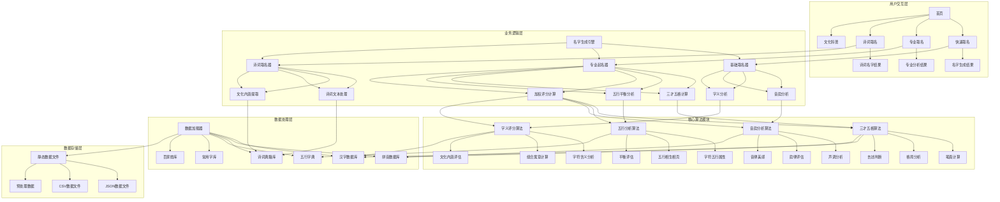
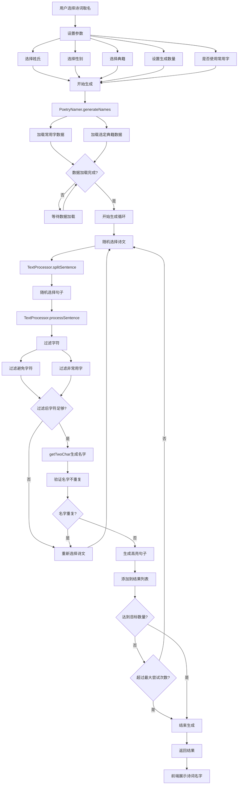
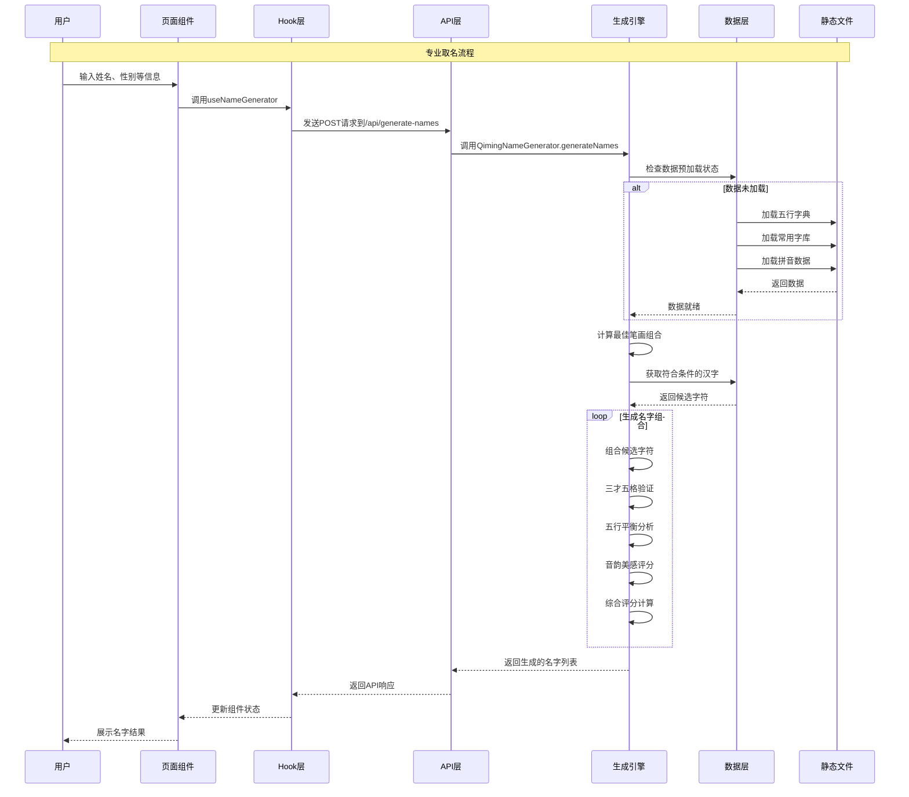

# 宝宝取名专家项目 - 完整设计与技术实现文档

## 项目概述

**宝宝取名专家**是一个基于传统文化智慧与现代科学方法相结合的智能取名系统。项目采用Next.js全栈架构，通过算法分析和文化内涵挖掘，为新生儿提供专业、个性化、有文化底蕴的名字推荐。

### 核心特色
- **传统文化传承**：基于三才五格、五行平衡、音韵美学等传统命名学理论
- **诗词文化内涵**：从经典诗词典籍中提取名字，富含文化底蕴
- **科学算法支撑**：多维度评分体系，透明化算法逻辑
- **个性化定制**：支持权重自定义，满足不同家庭需求

## 技术架构

### 技术栈选择

#### 前端技术栈
- **Next.js 14**: React全栈框架，支持SSR/SSG，优化SEO和性能
- **TypeScript**: 静态类型检查，提升代码质量和开发效率
- **Tailwind CSS**: 工具优先的CSS框架，快速构建响应式UI
- **React Hooks**: 函数式组件状态管理，代码更简洁

#### 后端架构
- **Next.js API Routes**: 无服务器函数，与前端无缝集成
- **纯前端实现**: 所有算法在浏览器端运行，保护用户隐私
- **静态数据**: 使用JSON/CSV文件存储数据，无需数据库

#### 数据管理
- **内存缓存**: 智能数据预加载和缓存机制
- **懒加载**: 按需加载数据文件，优化初始加载速度
- **数据预处理**: 离线处理数据，运行时快速响应

## 全局功能架构



## 系统技术架构

```mermaid
graph TD
    subgraph "前端架构 Next.js + React + TypeScript"
        A1[页面组件 Pages] --> A2[布局组件 Layout]
        A1 --> A3[业务组件 Components]
        A1 --> A4[工具组件 Utils]
        
        A5[自定义Hook] --> A6[useNameGenerator]
        A5 --> A7[usePoetryNamer]
        A5 --> A8[useDataPreloader]
        
        A9[样式系统] --> A10[Tailwind CSS]
        A9 --> A11[全局样式]
    end

    subgraph "后端架构 Next.js API Routes"
        B1[API路由] --> B2[generate-names]
        B1 --> B3[generate-poetry-names]
        B1 --> B4[generate-names-detailed]
        B1 --> B5[debug-word-search]
        
        B6[业务逻辑层] --> B7[QimingNameGenerator]
        B6 --> B8[PoetryNamer]
        B6 --> B9[SancaiWugeCalculator]
        B6 --> B10[WeightedScoreCalculator]
    end

    subgraph "核心算法引擎"
        C1[起名算法引擎] --> C2[三才五格计算器]
        C1 --> C3[五行分析器]
        C1 --> C4[音韵分析器]
        C1 --> C5[字义评分器]
        C1 --> C6[社会认知评分器]
        
        C7[诗词取名引擎] --> C8[文本处理器]
        C7 --> C9[随机选择器]
        C7 --> C10[高亮处理器]
    end

    subgraph "数据管理层"
        D1[数据加载器] --> D2[QimingDataLoader]
        D1 --> D3[WordDataLoader]
        D1 --> D4[BaijiaxingLoader]
        D1 --> D5[全局预加载器]
        
        D6[数据缓存] --> D7[内存缓存]
        D6 --> D8[懒加载机制]
        D6 --> D9[数据预处理]
    end

    subgraph "数据源层"
        E1[静态数据文件] --> E2[汉字数据]
        E1 --> E3[拼音数据]
        E1 --> E4[诗词典籍]
        E1 --> E5[五行字典]
        E1 --> E6[常用字库]
        E1 --> E7[百家姓数据]
        
        E8[预处理数据] --> E9[word-chunks]
        E8 --> E10[processed数据]
        E8 --> E11[索引文件]
    end

    A1 --> B1
    A5 --> B1
    B1 --> B6
    B6 --> C1
    B6 --> C7
    C1 --> D1
    C7 --> D1
    D1 --> D6
    D1 --> E1
    D6 --> E8
```



## 核心功能模块详细设计

### 1. 专业取名引擎 (QimingNameGenerator)

#### 功能概述
专业取名引擎是系统的核心算法模块，完全复现传统qiming项目的取名逻辑，通过多维度分析生成高质量名字。

#### 核心算法流程

##### 1.1 最佳笔画组合计算
```typescript
/**
 * 获取最佳笔画组合
 * 基于三才五格理论，计算出最优的中字和末字笔画数组合
 */
async getBestStrokeCombinations(
  familyName: string,
  useTraditional: boolean,
  specificBest: boolean
): Promise<StrokeCombination[]>
```

**实现原理**：
1. 计算姓氏笔画数（支持简体/繁体）
2. 遍历所有可能的两字名字笔画组合（通常5-20画）
3. 对每个组合计算三才五格数值
4. 根据三才五格吉凶表筛选出优秀组合
5. 按评分排序返回最佳组合

##### 1.2 五行要求确定
```typescript
/**
 * 确定五行要求
 * 根据配置或使用固定的五行组合
 */
private determineWuxingRequirements(config: NameGenerationConfig): {
  midWuxing: WuxingElement;
  lastWuxing: WuxingElement;
}
```

**实现原理**：
- 默认使用"水金"组合（与原qiming项目保持一致）
- 支持用户自定义五行偏好
- 确保五行搭配的相生相克关系

##### 1.3 字符候选筛选
```typescript
/**
 * 获取符合条件的候选字符
 */
async getWordsByStrokeAndWuxing(
  strokes: number,
  wuxing: WuxingElement,
  useTraditional: boolean
): Promise<string[]>
```

**实现原理**：
1. 从五行字典中筛选指定五行属性的字符
2. 按笔画数过滤
3. 结合常用字库，过滤掉生僻字
4. 应用用户的避用字设置

##### 1.4 名字验证与评分
```typescript
/**
 * 验证名字的三才五格
 */
async checkSancaiWuge(
  fullName: string,
  useTraditional: boolean
): Promise<NameValidationResult>
```

**评分维度**：
- **三才五格评分**：基于传统姓名学理论
- **五行平衡评分**：分析五行属性搭配
- **音韵美感评分**：声调组合和谐度
- **字义寓意评分**：字符含义的积极性
- **社会认知评分**：名字的社会接受度

### 2. 三才五格计算器 (SancaiWugeCalculator)

#### 功能概述
实现传统姓名学中的三才五格计算理论，包括天格、人格、地格、总格、外格的计算和吉凶判断。

#### 核心方法详解

##### 2.1 五格计算
```typescript
/**
 * 计算五格数值
 */
calculateGrids(familyName: string, firstName: string, lastName: string): GridCalculation
```

**计算公式**：
- **天格** = 姓氏笔画数之和 + 1（单姓）
- **人格** = 姓氏最后一字 + 名字第一字
- **地格** = 名字两字笔画数之和
- **总格** = 姓名全部字符笔画数之和
- **外格** = 天格 + 地格 - 人格

##### 2.2 三才分析
```typescript
/**
 * 分析三才组合
 */
analyzeSancai(grids: GridCalculation): SancaiResult
```

**分析步骤**：
1. 将五格数值转换为五行属性（天格→天才，人格→人才，地格→地才）
2. 分析三才的五行相生相克关系
3. 查询三才组合吉凶表
4. 生成详细的性格和运势分析

##### 2.3 吉凶评判
```typescript
/**
 * 评判数字的吉凶
 */
evaluateNumber(num: number): 'da_ji' | 'zhong_ji' | 'ji' | 'xiong' | 'da_xiong'
```

**评判标准**：
- **大吉数**：1, 3, 5, 7, 8, 11, 13, 15, 16, 18, 21, 23, 24, 25, 31, 32, 33, 35, 37, 39, 41, 45, 47, 48, 52, 57, 61, 63, 65, 67, 68, 81
- **中吉数**：6, 17, 26, 27, 29, 30, 38, 49, 51, 55, 58, 71, 73, 75
- **吉数**：其他非凶数
- **凶数**：2, 4, 9, 10, 12, 14, 19, 20, 22, 28, 34, 36, 40, 42, 43, 44, 46, 50, 53, 54, 56, 59, 60, 62, 64, 66, 69, 70, 72, 74, 76, 77, 78, 79, 80

### 3. 诗词取名引擎 (PoetryNamer)

#### 功能概述
基于中华传统文学典籍，通过文本分析和智能筛选，从诗词中提取富有文化内涵的名字。

#### 核心算法流程

##### 3.1 典籍数据加载
```typescript
/**
 * 加载诗词典籍数据
 */
async loadBook(book: PoetryBook): Promise<PoetryEntry[]>
```

**支持的典籍**：
- **诗经**：中国最早的诗歌总集，适合男孩取名
- **楚辞**：浪漫主义诗歌，适合女孩取名  
- **唐诗**：唐代诗歌精选，气韵开阔
- **宋词**：宋代词作精选，意境优美
- **论语**：儒家经典，寓意深远
- **千字文**：传统启蒙文本
- **宋诗**：宋代诗歌，理趣并重
- **元曲**：元代曲作，生动活泼

##### 3.2 文本处理算法
```typescript
/**
 * 处理诗词句子，提取可用字符
 */
class TextProcessor {
  splitSentence(content: string): string[]
  processSentence(sentence: string): string[]
  highlightNameInSentence(sentence: string, name: string): string
}
```

**处理步骤**：
1. **句子分割**：使用标点符号分割诗文
2. **字符提取**：去除标点、数字、特殊符号
3. **字符过滤**：应用常用字过滤和避用字过滤
4. **高亮处理**：在原句中高亮显示提取的名字

##### 3.3 名字生成算法
```typescript
/**
 * 从单篇诗文生成名字
 */
private generateNameFromPoetry(
  poetry: PoetryEntry,
  familyName: string,
  avoidedWords: string[],
  commonCharsSet: Set<string> | null
): PoetryNameResult | null
```

**生成策略**：
1. 随机选择诗文中的一个句子
2. 从句子中提取有效字符
3. 使用`getTwoChar`算法生成两字组合
4. 确保不重复生成相同名字
5. 保持字符在诗文中的相对位置

##### 3.4 性别适配推荐
根据传统"男诗经，女楚辞"的文化智慧：
- **男孩推荐**：诗经、唐诗（阳刚大气）
- **女孩推荐**：楚辞、宋词（柔美文雅）

## 诗词取名流程详解



### 4. 数据管理系统

#### 4.1 全局数据预加载器 (GlobalPreloader)
```typescript
/**
 * 全局数据预加载管理
 */
class GlobalPreloader {
  async preloadData(): Promise<void>
  isDataReady(): boolean
  getLoadingState(): LoadingState
}
```

**预加载策略**：
1. **应用启动时**：自动开始数据预加载
2. **异步执行**：不阻塞页面首次渲染
3. **错误容忍**：预加载失败不影响应用使用
4. **状态监控**：提供详细的加载状态信息

#### 4.2 数据加载器 (QimingDataLoader)
```typescript
/**
 * qiming数据加载器 - 单例模式
 */
class QimingDataLoader {
  static getInstance(): QimingDataLoader
  async loadWuxingDataSimplified(): Promise<WuxingDictionary>
  async getCommonNameWords(gender: string): Promise<Set<string>>
  async getWordsByStrokeAndWuxing(): Promise<string[]>
}
```

**数据文件结构**：
```
public/data/
├── wuxing_dict_jianti.json      # 简体五行字典
├── wuxing_dict_fanti.json       # 繁体五行字典
├── gsc_pinyin.csv               # 拼音声调数据
├── baijiaxing.json              # 百家姓数据
├── processed/
│   ├── common-chars-male.json   # 男性常用字
│   ├── common-chars-female.json # 女性常用字
│   └── pinyin-processed.json    # 预处理拼音数据
├── poetry/
│   ├── shijing.json            # 诗经
│   ├── chuci.json              # 楚辞
│   ├── tangshi.json            # 唐诗
│   └── songci.json             # 宋词
└── word-chunks/
    ├── chunk-000.json          # 分块汉字数据
    ├── chunk-001.json
    └── ...
```

#### 4.3 缓存机制
- **内存缓存**：所有加载的数据保存在内存中
- **懒加载**：按需加载大型数据文件
- **数据分块**：大型数据集分成小块文件，减少内存占用

### 5. 评分体系设计

#### 5.1 加权评分计算器 (WeightedScoreCalculator)
```typescript
/**
 * 动态权重评分计算器
 */
class WeightedScoreCalculator {
  calculateScore(components: ScoreComponents, weights: WeightConfig): DetailedScore
}
```

#### 5.2 评分维度详解

##### 三才五格评分 (25% 默认权重)
- **计算方式**：基于传统姓名学吉凶表
- **评分范围**：0-100分
- **关键因素**：五格数值的吉凶等级

##### 五行平衡评分 (25% 默认权重)  
- **计算方式**：分析五行相生相克关系
- **评分范围**：0-100分
- **关键因素**：五行属性的协调程度

##### 音韵美感评分 (20% 默认权重)
- **计算方式**：声调组合分析
- **评分范围**：0-100分
- **关键因素**：声调搭配的和谐度

##### 字义寓意评分 (20% 默认权重)
- **计算方式**：字符含义的积极性分析
- **评分范围**：0-100分
- **关键因素**：字符寓意的美好程度

##### 社会认知评分 (10% 默认权重)
- **计算方式**：基于常用字库的社会接受度
- **评分范围**：0-100分
- **关键因素**：名字的现代适用性

## 专业取名数据流程



### 6. API接口设计

#### 6.1 专业取名API
```typescript
POST /api/generate-names
```

**请求参数**：
```typescript
interface NameGenerationRequest {
  familyName: string;          // 姓氏
  gender: 'male' | 'female';   // 性别
  birthDate?: string;          // 出生日期
  birthTime?: string;          // 出生时间
  preferredElements?: string[]; // 五行偏好
  avoidedWords?: string[];     // 避用字
  scoreThreshold?: number;     // 评分阈值
  useTraditional?: boolean;    // 使用繁体
  limit?: number;              // 返回数量
  offset?: number;             // 分页偏移
}
```

**响应格式**：
```typescript
interface NameGenerationResponse {
  success: boolean;
  data: {
    names: GeneratedName[];
    pagination: {
      limit: number;
      offset: number;
      total: number;
      hasMore: boolean;
    };
    config: NameGenerationConfig;
  };
}
```

#### 6.2 诗词取名API
```typescript
POST /api/generate-poetry-names
```

**请求参数**：
```typescript
interface PoetryNamingRequest {
  familyName: string;           // 姓氏
  gender: 'male' | 'female';    // 性别
  books?: PoetryBook[];         // 选择的典籍
  nameCount?: number;           // 生成数量
  avoidedWords?: string[];      // 避用字
  useCommonChars?: boolean;     // 仅使用常用字
}
```

### 7. 用户界面设计

#### 7.1 页面结构
```
/                           # 首页 - 快速入口
├── /naming                 # 专业取名页面
├── /poetry-naming          # 诗词取名页面
├── /qiming-results         # 取名结果展示
├── /name/[id]             # 名字详情页面
├── /culture/              # 文化科普模块
│   ├── /sancai-wuge       # 三才五格解析
│   ├── /wuxing-balance    # 五行平衡说明  
│   └── /phonetic-beauty   # 音韵美学介绍
└── /about                 # 关于页面
```

#### 7.2 核心组件设计

##### 名字卡片组件 (NameCard)
```typescript
interface NameCardProps {
  familyName: string;     // 姓氏
  givenName: string;      // 名字
  meaning: string;        // 含义解释
  popularity?: number;    // 流行度 (1-100)
  onClick?: () => void;   // 点击回调
}
```

**功能特点**：
- 流行度等级显示（罕见、少见、一般、常见、流行）
- 和谐度进度条
- 点击查看详情功能
- 响应式设计

##### 候选筛选弹窗 (CandidateFilteringPopup)
- 实时筛选候选字符
- 支持按笔画数、五行属性筛选
- 可视化展示筛选结果

##### 权重配置组件 (WeightConfigPanel)
- 滑块调节各维度权重
- 实时预览权重变化效果
- 重置到默认配置

### 8. 性能优化策略

#### 8.1 数据加载优化
- **预加载机制**：应用启动时异步加载核心数据
- **分块加载**：大型数据集分块存储，按需加载
- **内存缓存**：已加载数据保存在内存中
- **压缩存储**：JSON数据压缩，减少传输体积

#### 8.2 算法性能优化  
- **索引优化**：为常用查询建立索引结构
- **并行计算**：多个名字验证并行执行
- **早期终止**：达到目标数量后立即停止生成
- **缓存计算结果**：相同输入缓存计算结果

#### 8.3 前端性能优化
- **代码分割**：按路由分割代码，减少初始包体积
- **图片优化**：使用WebP格式，实现懒加载
- **CSS优化**：使用Tailwind CSS的JIT编译
- **缓存策略**：合理设置浏览器缓存策略

### 9. 特色功能创新

#### 9.1 透明化算法
- **评分明细**：每个名字提供详细的评分解释
- **算法公开**：完全公开评分逻辑和计算过程
- **个性调节**：用户可调整评分权重比例

#### 9.2 文化传承
- **经典出处**：诗词名字标注具体出处和作者
- **文化解读**：提供深度的文化内涵解析
- **传统智慧**：融合"男诗经，女楚辞"等传统取名文化

#### 9.3 隐私保护
- **纯前端实现**：所有计算在浏览器端完成
- **无数据上传**：用户信息不会上传到服务器
- **离线可用**：核心功能支持离线使用

### 10. 项目特色亮点

#### 10.1 技术架构亮点
1. **Next.js全栈架构**：前后端一体化，开发效率高
2. **TypeScript严格模式**：类型安全，代码质量高
3. **模块化设计**：功能模块清晰分离，易于维护
4. **性能优化**：数据预加载、内存缓存、懒加载等多重优化

#### 10.2 算法设计特色
1. **完全复现qiming算法**：保持传统命名学的严谨性
2. **多维度评分体系**：综合考虑多个维度，评分更全面
3. **权重可调**：支持个性化定制，满足不同需求
4. **透明化计算**：所有评分都有详细解释

#### 10.3 文化内涵深度
1. **经典文学整合**：涵盖8大经典文学作品
2. **传统智慧传承**：遵循"男诗经，女楚辞"等文化传统
3. **文化科普功能**：深度解读传统取名文化
4. **诗词出处追溯**：每个名字都有具体的文学出处

#### 10.4 用户体验优势
1. **渐进式功能**：从简单到专业的多层次取名方式
2. **实时反馈**：即时显示生成进度和结果
3. **响应式设计**：适配各种设备和屏幕尺寸
4. **隐私保护**：纯前端实现，保护用户隐私

### 11. 与其他取名项目的对比

#### 11.1 与PiPiName项目对比
| 特性 | 宝宝取名专家 | PiPiName |
|------|------------|-----------|
| 技术栈 | Next.js + TypeScript | Python |
| 部署方式 | Web应用 | 命令行工具 |
| 用户界面 | 现代化Web UI | 命令行界面 |
| 数据管理 | 智能预加载+缓存 | 文件直接读取 |
| 算法透明度 | 完全公开评分逻辑 | 部分公开 |
| 个性化程度 | 权重可调，高度定制 | 配置文件设置 |
| 文化内涵 | 8大典籍+文化科普 | 7种文学来源 |

#### 11.2 与fate项目对比
| 特性 | 宝宝取名专家 | fate (Go版本) |
|------|------------|---------------|
| 编程语言 | TypeScript/JavaScript | Go |
| 运行环境 | 浏览器 | 服务器 |
| 并发处理 | 单线程 | Go协程 |
| 数据处理 | JSON/CSV | 数据库 |
| 功能范围 | 专注取名 | 综合命理 |
| 用户交互 | Web界面 | API接口 |

### 12. 项目价值与意义

#### 12.1 技术价值
- **现代Web技术实践**：展示了Next.js全栈开发的最佳实践
- **算法工程化**：将传统算法现代化，提升计算效率
- **前端性能优化**：在纯前端实现复杂算法的同时保持良好性能
- **数据处理技巧**：大型数据集的分块处理和缓存策略

#### 12.2 文化价值
- **传统文化传承**：让年轻一代更好地了解传统取名文化
- **文学教育意义**：通过取名了解经典文学作品
- **文化自信提升**：展示中华文化的博大精深
- **现代化传承方式**：用现代技术传承古老智慧

#### 12.3 实用价值
- **解决实际需求**：为新生儿取名提供科学参考
- **提升决策质量**：多维度分析帮助家长做出更好选择
- **节省时间成本**：自动化生成替代人工查找
- **个性化服务**：满足不同家庭的独特需求

### 13. 开发规范和最佳实践

#### 13.1 代码规范
- **TypeScript严格模式**：启用严格类型检查
- **ESLint规则**：使用Next.js推荐的ESLint配置
- **代码注释**：核心算法必须有详细注释
- **单元测试**：关键算法模块编写单元测试

#### 13.2 文件组织
```
src/
├── components/          # 可复用组件
├── pages/              # 页面组件
├── hooks/              # 自定义Hook
├── lib/                # 核心业务逻辑
│   ├── qiming/         # 专业取名引擎
│   ├── poetry-namer/   # 诗词取名引擎
│   └── config.ts       # 配置文件
├── utils/              # 工具函数
├── styles/             # 样式文件
└── data/               # 类型定义
```

#### 13.3 错误处理
- **优雅降级**：数据加载失败时提供备选方案
- **错误边界**：React错误边界捕获组件错误
- **用户友好**：错误信息以用户友好的方式展示
- **日志记录**：开发环境详细记录错误信息

### 14. 扩展性和未来发展

#### 14.1 功能扩展方向
- **多语言支持**：扩展到其他语言的取名系统
- **移动应用**：开发React Native移动应用版本
- **AI智能推荐**：引入机器学习提升推荐质量
- **社区功能**：添加用户评价和分享功能

#### 14.2 技术升级路径
- **性能优化**：WebAssembly加速核心算法
- **离线支持**：PWA技术实现完全离线使用
- **实时协作**：支持多人实时讨论取名
- **可视化增强**：3D可视化展示名字分析结果

#### 14.3 商业化潜力
- **SaaS服务**：提供企业级取名服务
- **API开放**：向第三方开发者提供API接口
- **定制化服务**：为特定行业提供专业取名服务
- **教育产品**：开发传统文化教育产品

## 总结

**宝宝取名专家**项目通过现代Web技术与传统文化智慧的深度融合，创建了一个功能完整、性能优秀、用户体验良好的智能取名系统。项目的核心优势在于：

### 🎯 核心优势
1. **算法透明化**：完全公开评分逻辑，让用户了解每个分数的来源
2. **文化传承性**：深度挖掘中华传统文化，让取名更有文化底蕴  
3. **个性化定制**：支持权重调节，满足不同家庭的取名偏好
4. **隐私保护性**：纯前端实现，保护用户隐私数据
5. **性能优越性**：秒级响应，良好的用户体验

### 🏆 技术成就
- 完整复现了传统qiming取名算法的TypeScript版本
- 实现了8大经典文学作品的智能文本处理
- 建立了完善的多维度评分体系
- 创新性地将传统算法Web化，保持了算法的严谨性

### 📚 文化贡献
- 让传统文化在数字时代焕发新的生命力
- 为传统文化的现代化传承提供了优秀范例
- 通过技术手段让更多人了解和学习传统文化
- 将"男诗经，女楚辞"等传统智慧传承给新一代

### 🚀 未来展望
这个项目不仅是一个实用的取名工具，更是传统文化与现代技术完美结合的典型案例。它展示了如何在保持传统文化精髓的同时，运用现代技术提升用户体验和功能效率。

通过本项目的深入分析，我们可以看到：技术的进步不仅能够提升工作效率，更重要的是可以成为文化传承的重要载体。当古老的智慧遇上现代的技术，产生的不仅是功能的提升，更是文化价值的重新发现和传承。

这正是**宝宝取名专家**项目的真正价值所在——在为用户提供实用功能的同时，也在默默地传承着中华文化的精髓，让每一个通过这个系统取得的名字，都承载着深厚的文化内涵和美好的寓意。
