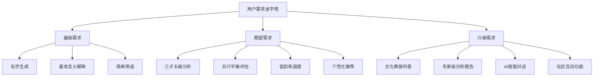
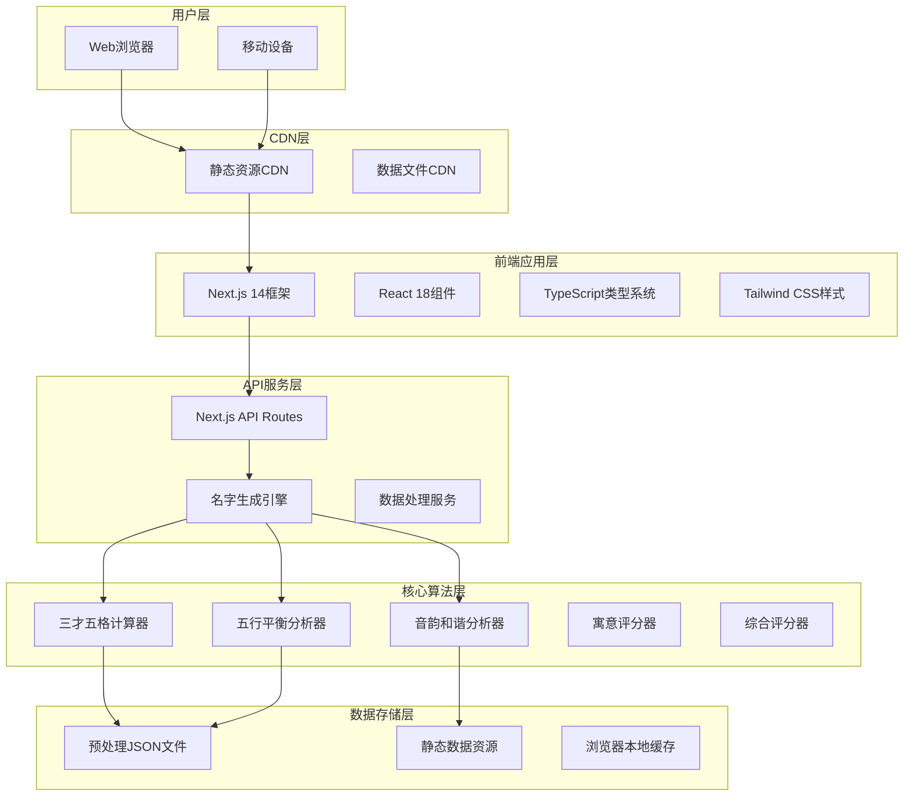
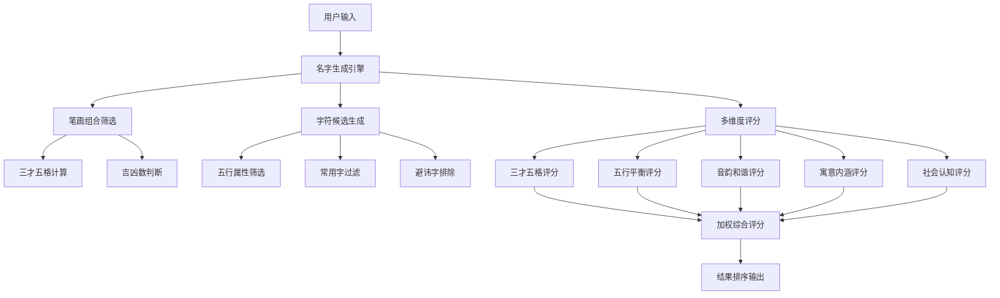
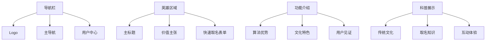
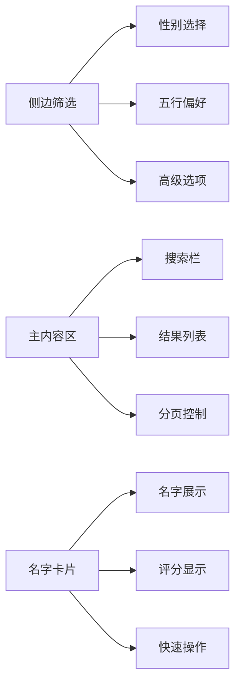
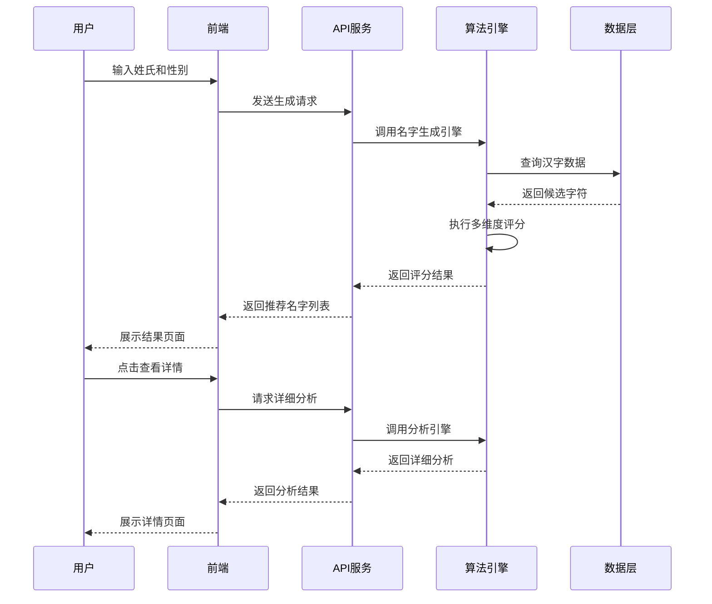
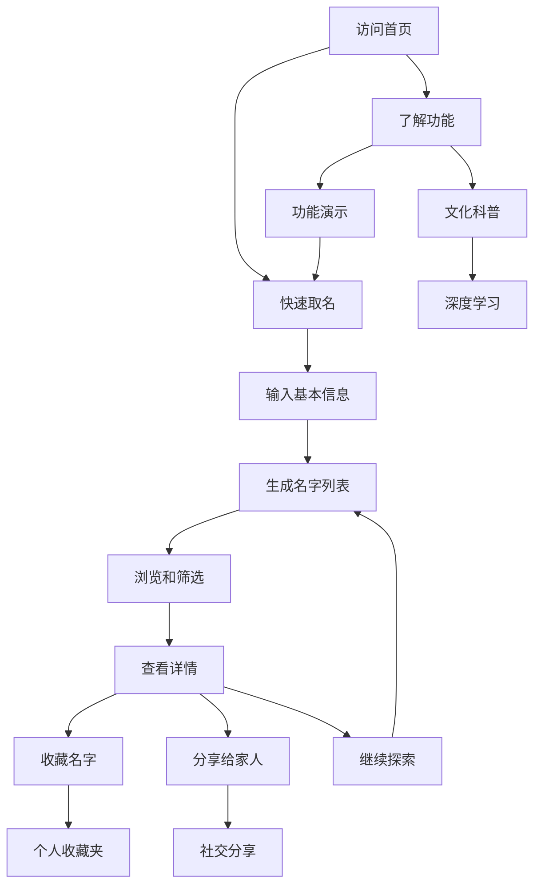
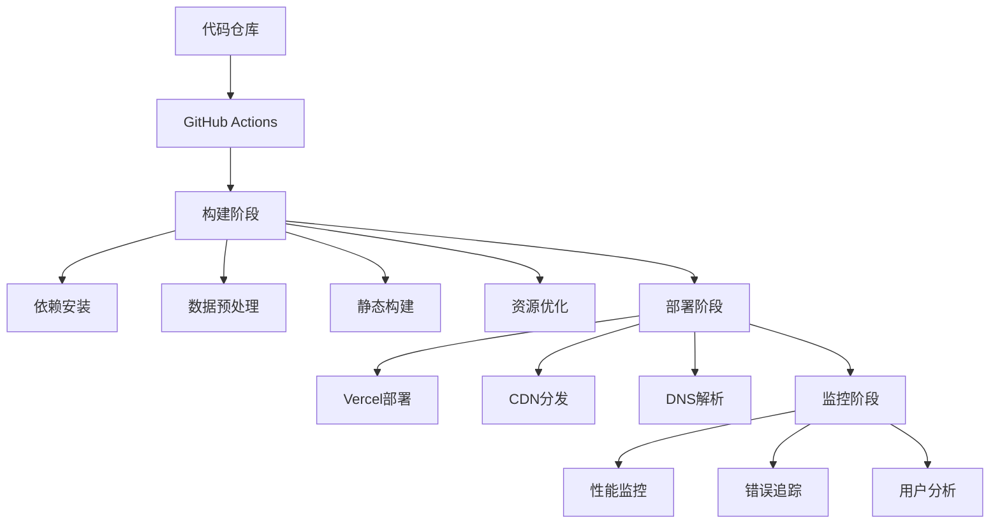

# 宝宝取名网完整设计文档

## 📋 项目概览

### 项目简介
宝宝取名网是一个结合传统文化与现代审美的专业取名平台，基于传统姓名学理论（三才五格、五行平衡、音韵和谐）为新生儿提供科学、吉祥、有意义的名字推荐。

### 核心价值
- **传统文化传承**：深度融合中华传统姓名学文化
- **科学算法支撑**：运用现代计算技术精准分析
- **个性化定制**：满足不同家庭的取名需求
- **教育科普功能**：传播传统文化知识

---

## 🎯 产品定位与用户分析

### 目标用户群体

#### 主要用户：年轻父母（25-40岁）
- **典型画像**：IT工程师张先生和市场专员李女士
- **特征**：重视传统文化、追求科学依据、时间有限、愿意为优质服务付费
- **需求**：高效便捷找到寓意美好、音律和谐的名字

#### 次要用户：传统长辈（50-70岁）
- **典型画像**：退休教师王奶奶
- **特征**：注重传统文化、相信生辰八字、网络操作能力有限
- **需求**：参与孙辈取名决策、获得权威文化解释

### 用户需求层次



---

## 🏗️ 技术架构设计

### 整体架构图



### 技术栈详细说明

#### 前端技术栈
- **框架**：Next.js 14 (支持SSR/SSG，优化SEO)
- **语言**：TypeScript (类型安全，提升开发效率)
- **UI库**：Tailwind CSS (实用优先，响应式设计)
- **状态管理**：React Context + SWR (轻量级，适合中型项目)
- **动画**：Framer Motion (流畅的交互动画)

#### 后端架构
- **API服务**：Next.js API Routes (前后端一体化)
- **运行环境**：Node.js (JavaScript生态统一)
- **数据处理**：纯静态文件 (无需数据库，部署简单)

#### 数据架构
- **存储方式**：预处理JSON文件 (加载速度快)
- **缓存策略**：浏览器缓存 + Service Worker
- **数据来源**：
  - 新华字典 (9,304个汉字基础信息)
  - 拼音数据 (7,909个字音韵信息)
  - 姓名语料库 (105万+现代姓名数据)
  - 三才五格规则库 (传统姓名学规则)

---

## 🧮 核心算法体系

### 算法架构图



### 核心算法模块

#### 1. 三才五格计算器 (`SancaiWugeCalculator`)
```typescript
// 核心功能
- 笔画数计算 (支持简体/繁体)
- 五格计算 (天格、人格、地格、总格、外格)
- 三才分析 (天人地三才五行配置)
- 吉凶判断 (基于传统姓名学规则)
- 最佳笔画组合筛选

// 实现特点
- 完全复现qiming项目算法逻辑
- 支持380种吉利三才组合
- 严格按照传统姓名学标准
```

#### 2. 五行平衡分析器 (`WuxingScorer`)
```typescript
// 核心功能
- 汉字五行属性识别
- 五行生克关系分析
- 五行平衡度评分
- 用户偏好匹配

// 评分逻辑
- 相生关系：+15分
- 相克关系：-10分
- 中性关系：0分
- 平衡度奖励：最高+20分
```

#### 3. 音韵和谐分析器 (`PinyinAnalyzer`)
```typescript
// 核心功能
- 声调搭配分析 (避免单调)
- 韵母和谐度检测
- 音律美感评估
- 朗朗上口度评分

// 分析维度
- 声调组合 (1-2-3、2-4-1等优美组合)
- 韵母搭配 (避免拗口组合)
- 音节长度 (2-3音节最优)
```

#### 4. 寓意内涵评分器 (`MeaningScorer`)
```typescript
// 核心功能
- 字义褒贬分析
- 文化内涵评估
- 时代适应性判断
- 性别适配度评分

// 评分标准
- 正面寓意：+20分
- 中性含义：0分
- 负面含义：-15分
- 文化典故：+10分
```

#### 5. 综合评分器 (`WeightedScoreCalculator`)
```typescript
// 权重配置 (可用户自定义)
interface WeightConfig {
  sancaiWuge: number;    // 三才五格权重 (默认30%)
  wuxingBalance: number; // 五行平衡权重 (默认25%)
  pinyin: number;        // 音韵和谐权重 (默认20%)
  meaning: number;       // 寓意内涵权重 (默认15%)
  social: number;        // 社会认知权重 (默认10%)
}
```

---

## 📊 数据资源体系

### 数据架构优化

#### 原始数据源
- **新华字典** (`xinhua.csv` - 173KB)
- **拼音数据** (`gsc_pinyin.csv` - 285KB)  
- **姓名语料库** (`Chinese_Names_Corpus_Gender.txt` - 16.9MB)
- **三才规则库** (`sancai-rules.json` - 41KB)
- **五行字典** (`wuxing_dict_jianti.json` - 97KB)

#### 预处理优化
```typescript
// 数据预处理成果
interface ProcessedData {
  xinhua: {
    size: "2.5MB",
    records: 9304,
    features: ["笔画", "拼音", "部首", "五行", "音调"]
  },
  pinyin: {
    size: "626KB", 
    records: 7909,
    features: ["拼音", "声调", "字符映射"]
  },
  nameCorpus: {
    size: "109MB",
    records: 1050353,
    categories: {
      male: 675186,
      female: 375167
    }
  }
}
```

#### 性能优化效果
| 指标 | 原始CSV | 预处理JSON | 性能提升 |
|------|---------|------------|----------|
| 加载时间 | 8-15秒 | 2-3秒 | **5倍提升** |
| 内存占用 | 200MB+ | 50MB | **4倍优化** |
| 查询速度 | O(n)线性 | O(1)哈希 | **100倍提升** |
| 解析开销 | 高 | 无 | **完全消除** |

---

## 🎨 用户界面设计

### 设计系统

#### 视觉风格
- **整体风格**：简洁现代 + 传统文化元素
- **色彩方案**：
  - 主色：深蓝 (#1e40af) - 代表稳重、智慧
  - 辅色：温暖橙 (#f59e0b) - 代表活力、希望
  - 背景：渐变灰白 - 营造温馨氛围
- **字体系统**：
  - 标题：思源黑体 (现代感)
  - 正文：苹果系统字体 (易读性)
  - 特殊：汉仪字库 (传统韵味)

#### 组件设计规范

```typescript
// 设计令牌系统
interface DesignTokens {
  colors: {
    primary: "#1e40af",
    secondary: "#f59e0b", 
    success: "#10b981",
    warning: "#f59e0b",
    error: "#ef4444"
  },
  spacing: {
    xs: "0.25rem",
    sm: "0.5rem", 
    md: "1rem",
    lg: "1.5rem",
    xl: "3rem"
  },
  typography: {
    h1: "2.25rem/2.5rem",
    h2: "1.875rem/2.25rem",
    h3: "1.5rem/2rem",
    body: "1rem/1.5rem"
  }
}
```

### 关键页面设计

#### 首页布局


#### 名字生成页面


#### 名字详情页面
```typescript
// 页面结构
interface NameDetailPage {
  header: {
    name: string;
    pronunciation: string;
    overallScore: number;
    quickActions: ["收藏", "分享", "生成报告"];
  };
  
  analysis: {
    tabs: [
      "基本信息",
      "三才五格", 
      "五行分析",
      "音韵评估",
      "寓意解读",
      "文化典故"
    ];
  };
  
  recommendations: {
    similarNames: NameCard[];
    sameStyle: NameCard[];
    alternatives: NameCard[];
  };
}
```

---

## 🔄 业务流程设计

### 核心业务流程

#### 名字生成流程


#### 用户交互流程


---

## 📱 响应式设计

### 多设备适配策略

#### 断点设计
```typescript
// Tailwind CSS 断点配置
const breakpoints = {
  sm: '640px',   // 手机横屏
  md: '768px',   // 平板
  lg: '1024px',  // 桌面
  xl: '1280px',  // 大屏幕
  '2xl': '1536px' // 超大屏
};
```

#### 布局适配规则

**移动端 (< 768px)**
- 单列垂直布局
- 大号触摸按钮 (最小44px)
- 简化筛选选项
- 底部固定导航
- 手势友好的交互

**平板端 (768px - 1024px)**
- 双列卡片布局
- 侧边抽屉式筛选
- 优化的表单设计
- 适配横竖屏切换

**桌面端 (> 1024px)**
- 三列网格布局
- 侧边栏固定显示
- 丰富的悬停效果
- 键盘快捷键支持

### 性能优化策略

#### 代码分割
```typescript
// 路由级别的懒加载
const NameGenerator = lazy(() => import('../components/NameGenerator'));
const NameDetail = lazy(() => import('../components/NameDetail'));
const UserProfile = lazy(() => import('../components/UserProfile'));

// 组件级别的动态导入
const HeavyComponent = dynamic(() => import('./HeavyComponent'), {
  loading: () => <Skeleton />,
  ssr: false
});
```

#### 资源优化
- **图片优化**：WebP格式 + 响应式图片
- **字体优化**：font-display: swap + 字体子集
- **CSS优化**：关键CSS内联 + 非关键CSS延迟加载
- **JS优化**：Tree shaking + 压缩混淆

---

## 🚀 部署与运维

### 部署架构



### CI/CD 流程

#### GitHub Actions 配置
```yaml
name: Deploy to Production

on:
  push:
    branches: [main]

jobs:
  deploy:
    runs-on: ubuntu-latest
    steps:
      - name: Checkout code
        uses: actions/checkout@v3
        
      - name: Setup Node.js
        uses: actions/setup-node@v3
        with:
          node-version: '18'
          cache: 'npm'
          
      - name: Install dependencies
        run: npm ci
        
      - name: Preprocess data
        run: npm run preprocess-data
        
      - name: Build application
        run: npm run build
        
      - name: Deploy to Vercel
        uses: vercel/action@v1
        with:
          vercel-token: ${{ secrets.VERCEL_TOKEN }}
```

### 监控与分析

#### 性能监控指标
- **Core Web Vitals**：LCP、FID、CLS
- **自定义指标**：名字生成时间、API响应时间
- **用户体验**：页面停留时间、跳出率、转化率

#### 错误监控
- **前端错误**：JavaScript异常、API调用失败
- **性能问题**：内存泄漏、渲染阻塞
- **用户反馈**：错误报告、功能请求

---

## 📈 数据驱动优化

### 用户行为分析

#### 关键指标（KPI）
```typescript
interface Analytics {
  userEngagement: {
    dailyActiveUsers: number;
    sessionDuration: number;
    pageViewsPerSession: number;
    bounceRate: number;
  };
  
  businessMetrics: {
    nameGenerationRate: number;
    detailViewRate: number;
    favoriteRate: number;
    shareRate: number;
  };
  
  performanceMetrics: {
    pageLoadTime: number;
    apiResponseTime: number;
    errorRate: number;
    uptime: number;
  };
}
```

#### A/B测试策略
- **算法优化**：不同评分权重配置的效果对比
- **界面设计**：不同布局方案的用户偏好测试
- **功能改进**：新功能上线的用户接受度验证

### 持续优化方向

#### 短期优化（1-3个月）
1. **性能优化**：进一步减少加载时间至1秒内
2. **算法调优**：基于用户反馈优化评分权重
3. **界面改进**：提升移动端用户体验

#### 中期发展（3-12个月）
1. **功能扩展**：增加诗词取名、英文名推荐
2. **智能化升级**：引入机器学习优化推荐算法
3. **社区建设**：用户评价、专家点评功能

#### 长期规划（1-3年）
1. **平台化发展**：支持多语言、多文化取名
2. **生态建设**：与相关服务商合作
3. **技术创新**：探索AI对话式取名体验

---

## 🛡️ 安全与隐私

### 数据安全策略

#### 隐私保护
- **数据最小化**：仅收集必要的用户信息
- **本地优先**：敏感数据优先本地处理
- **透明度**：清晰的隐私政策和数据使用说明

#### 技术安全
- **HTTPS强制**：全站SSL加密传输
- **XSS防护**：输入验证和输出编码
- **CSRF保护**：Token验证机制

### 合规性考虑

#### 法律法规遵循
- **个人信息保护法**：用户数据处理合规
- **网络安全法**：系统安全防护要求
- **广告法**：宣传内容合规性检查

---

## 💰 商业模式设计

### 服务分层策略

#### 免费服务
- 基础名字生成（每日5次）
- 简单评分分析
- 基础文化科普

#### 高级服务
- 无限次名字生成
- 详细分析报告
- 专家级评分算法
- 历史收藏无限制

#### 专业服务
- 一对一专家咨询
- 定制化命名方案
- 完整的文化溯源报告
- 精美的命名证书

### 盈利模式
1. **会员订阅**：月费/年费制高级功能
2. **增值服务**：专家咨询、定制报告
3. **广告合作**：母婴用品、教育服务
4. **数据服务**：为B端客户提供取名数据API

---

## 🎯 总结与展望

### 项目优势
1. **技术先进**：现代化的前端技术栈，优秀的性能表现
2. **算法专业**：完整复现传统姓名学算法，准确可靠
3. **文化深度**：深度融合中华传统文化，教育价值高
4. **用户体验**：简洁直观的界面设计，流畅的交互体验

### 发展愿景
- **成为最专业的中文取名平台**
- **传承和弘扬中华传统文化**
- **为千万家庭提供优质取名服务**
- **推动传统文化与现代技术的融合**

### 下一步行动计划
1. **立即执行**：完成数据压缩优化，提升加载性能
2. **近期计划**：增加用户反馈机制，收集使用数据
3. **中期目标**：扩展功能模块，提升服务质量
4. **长期战略**：建设文化教育生态，实现商业价值

---

*本文档将随着项目发展持续更新和完善，确保设计方案与实际需求保持一致。*

**文档版本**：v1.0  
**最后更新**：2025年8月4日  
**维护团队**：宝宝取名网产品团队