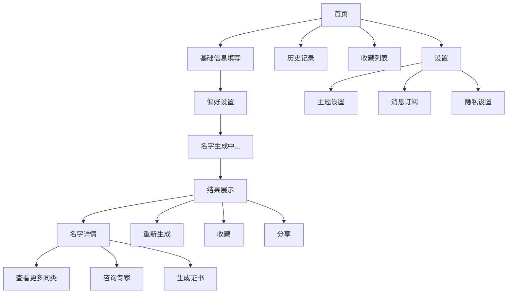
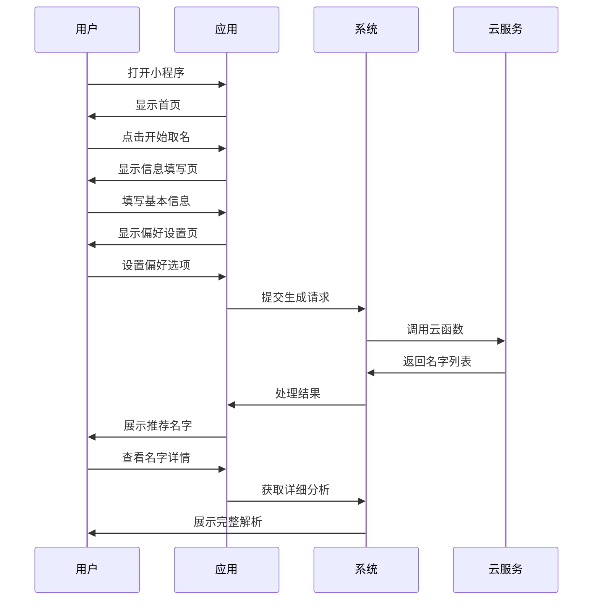
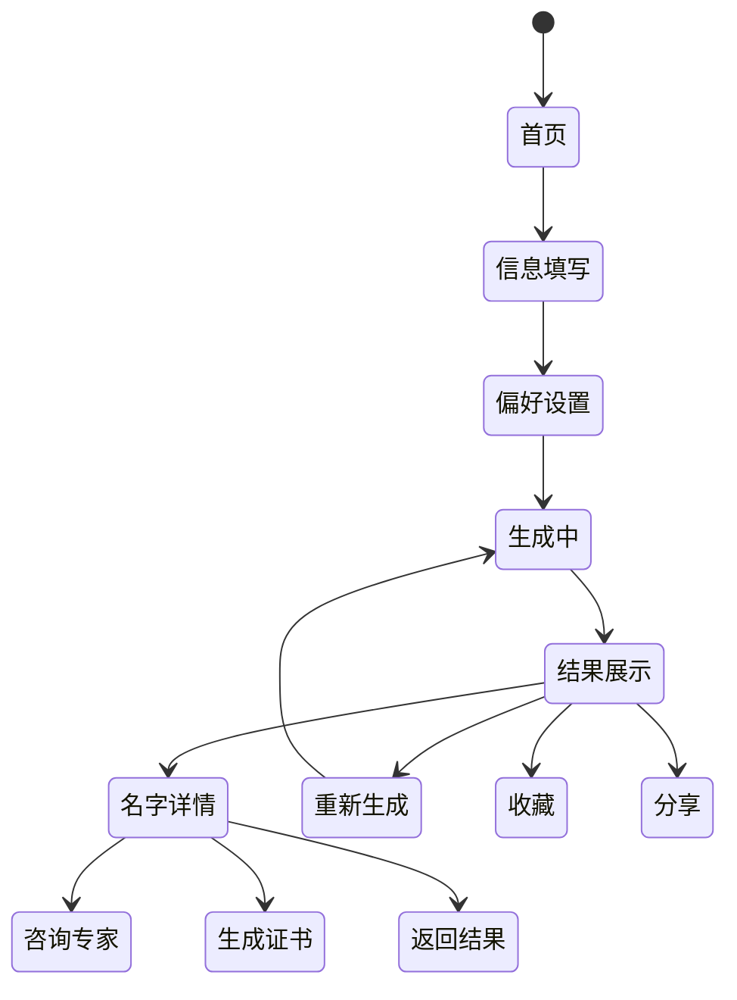

# 中国传统婴儿取名系统原型设计文档

## 目录

1. [系统概述](#1-系统概述)
2. [功能模块设计](#2-功能模块设计)
3. [数据结构设计](#3-数据结构设计)
4. [界面原型设计](#4-界面原型设计)
5. [交互流程设计](#5-交互流程设计)
6. [动态配置系统](#6-动态配置系统)
7. [评分系统设计](#7-评分系统设计)
8. [技术架构设计](#8-技术架构设计)

## 1. 系统概述

### 1.1 项目背景
本系统旨在为新生儿父母提供一个基于中国传统文化的智能取名平台，结合传统命理、现代语言学、社会发展等多个维度，为用户提供科学、合理的取名建议。

### 1.2 设计目标
- 提供个性化的取名服务
- 结合传统文化与现代需求
- 支持灵活的维度配置
- 提供科学的评分系统
- 确保良好的用户体验

### 1.3 核心功能
- 智能取名推荐
- 多维度名字分析
- 个性化偏好设置
- 名字评分与解析
- 动态配置管理

## 2. 功能模块设计

### 2.1 基础信息采集模块
```typescript
interface BasicInfo {
    lastName: string;           // 姓氏
    birthDateTime: Date;        // 出生日期时间
    gender: 'male' | 'female';  // 性别
    birthPlace?: string;        // 出生地点（可选）
    familyPreferences?: {       // 家庭偏好
        nameLength: 1 | 2;      // 名字长度
        style: string[];        // 风格偏好
        avoidChars: string[];   // 避讳字
    };
}
```

### 2.2 维度分析模块
```typescript
interface DimensionAnalysis {
    traditional: {             // 传统文化维度
        fiveElements: boolean; // 五行分析
        zodiac: boolean;       // 生肖分析
        cultural: boolean;     // 文化内涵
    };
    modern: {                 // 现代特征维度
        international: boolean;// 国际化
        career: boolean;      // 职业发展
        social: boolean;      // 社交影响
    };
    personal: {               // 个人期望维度
        personality: boolean; // 性格特征
        talent: boolean;      // 才能倾向
        interest: boolean;    // 兴趣方向
    };
}
```

### 2.3 名字生成模块
```typescript
interface NameGeneration {
    strategy: {
        traditional: number;   // 传统元素权重
        modern: number;       // 现代元素权重
        personal: number;     // 个人元素权重
    };
    filters: {
        minScore: number;     // 最低评分
        style: string[];      // 风格过滤
        exclude: string[];    // 排除字符
    };
    output: {
        limit: number;        // 生成数量
        sort: string;         // 排序方式
    };
}
```

### 2.4 评分系统模块
```typescript
interface ScoringSystem {
    dimensions: {
        name: string;         // 维度名称
        weight: number;       // 权重
        calculator: Function; // 计算函数
    }[];
    rules: {
        min: number;         // 最小分数
        max: number;         // 最大分数
        threshold: number;   // 及格线
    };
    analysis: {
        detailed: boolean;   // 详细分析
        suggestions: boolean;// 改进建议
    };
}
```

## 3. 数据结构设计

### 3.1 核心数据结构
```typescript
// 字符数据结构
interface Character {
    char: string;            // 汉字
    pinyin: string;         // 拼音
    tone: number;           // 声调
    meaning: string[];      // 含义
    fiveElement: string;    // 五行
    strokes: number;        // 笔画
    frequency: number;      // 使用频率
    attributes: string[];   // 特性标签
}

// 名字结构
interface Name {
    fullName: string;       // 完整名字
    firstName: string;      // 姓
    givenName: string;     // 名
    analysis: {            // 分析结果
        overall: number;    // 总分
        dimensions: {       // 维度得分
            [key: string]: number;
        };
        details: {         // 详细分析
            [key: string]: any;
        };
    };
}
```

### 3.2 配置数据结构
```typescript
// 维度配置
interface DimensionConfig {
    id: string;
    name: string;
    weight: number;
    enabled: boolean;
    calculator: string;
    params: any;
}

// 评分规则
interface ScoringRule {
    dimension: string;
    formula: string;
    constraints: {
        min: number;
        max: number;
    };
}
```

## 4. 界面原型设计

### 4.1 页面原型
```text
1. 首页
┌──────────────────────────────┐
│     ╭───────────────╮       │
│     │   Logo设计    │       │
│     ╰───────────────╯       │
│                            │
│   ┌────────────────────┐   │
│   │   开始智能取名     │   │
│   └────────────────────┘   │
│                            │
│   [ 最近推荐 ]            │
│   ┌──────┐ ┌──────┐      │
│   │名字1 │ │名字2 │      │
│   └──────┘ └──────┘      │
│                            │
│   [ 热门名字 ]            │
│   ┌──────┐ ┌──────┐      │
│   │推荐1 │ │推荐2 │      │
│   └──────┘ └──────┘      │
└──────────────────────────────┘

2. 基础信息填写页
┌──────────────────────────────┐
│   < 返回    基本信息    ... │
│                            │
│   姓氏：                    │
│   ┌────────────────────┐   │
│   │    输入框          │   │
│   └────────────────────┘   │
│                            │
│   出生日期：               │
│   ┌────────────────────┐   │
│   │ 日期选择器         │   │
│   └────────────────────┘   │
│                            │
│   出生时辰：               │
│   ┌────────────────────┐   │
│   │ 时辰选择器         │   │
│   └────────────────────┘   │
│                            │
│   性别：                   │
│   ○ 男  ○ 女             │
│                            │
│   ┌────────────────────┐   │
│   │     下一步         │   │
│   └────────────────────┘   │
└──────────────────────────────┘

3. 偏好设置页
┌──────────────────────────────┐
│   < 返回    偏好设置    ... │
│                            │
│   名字长度：               │
│   ○ 单字  ○ 双字         │
│                            │
│   风格偏好：               │
│   □ 文艺  □ 典雅         │
│   □ 现代  □ 国际化       │
│   □ 传统  □ 个性化       │
│                            │
│   五行喜好：               │
│   □ 金  □ 木  □ 水      │
│   □ 火  □ 土             │
│                            │
│   避讳字：                 │
│   ┌────────────────────┐   │
│   │ 输入需要避免的字   │   │
│   └────────────────────┘   │
│                            │
│   ┌────────────────────┐   │
│   │   开始生成名字     │   │
│   └────────────────────┘   │
└──────────────────────────────┘

4. 结果展示页
┌──────────────────────────────┐
│   < 返回    推荐结果    ... │
│                            │
│   [ 推荐名字卡片 ]         │
│   ┌────────────────────┐   │
│   │ 张雨晴  (95分)     │   │
│   │ 五行：水木相生     │   │
│   │ 释义：清新雅致     │   │
│   │ ♡ 收藏  ↗ 分享    │   │
│   └────────────────────┘   │
│                            │
│   [ 维度分析 ]            │
│   ┌────────────────────┐   │
│   │ 传统文化：95分     │   │
│   │ 语言学：90分       │   │
│   │ 社会适应：88分     │   │
│   └────────────────────┘   │
│                            │
│   [ 详细解析 ]            │
│   ┌────────────────────┐   │
│   │ 字义详解...        │   │
│   │ 五行分析...        │   │
│   └────────────────────┘   │
└──────────────────────────────┘

5. 名字详情页
┌──────────────────────────────┐
│   < 返回    名字详情    ... │
│                            │
│   张雨晴                    │
│   ┌────────────────────┐   │
│   │ 总分：95分         │   │
│   └────────────────────┘   │
│                            │
│   【字义解析】             │
│   雨：自然降水，滋润万物   │
│   晴：阳光明媚，光明美好   │
│                            │
│   【五行分析】             │
│   天干：丙火               │
│   地支：戊土               │
│   八字：水木相生          │
│                            │
│   【音韵分析】             │
│   声调：平仄和谐          │
│   读音：优美动听          │
│                            │
│   【文化内涵】             │
│   诗词典故：诗经・雨晴    │
│   历史名人：...           │
│                            │
│   ┌────────┐ ┌────────┐   │
│   │ 收藏  │ │ 分享  │   │
│   └────────┘ └────────┘   │
└──────────────────────────────┘
```

### 4.2 交互流程图


### 4.3 用户操作流程


### 4.4 状态流转图


### 4.5 组件交互设计
```typescript
// 名字卡片交互
interface NameCardInteractions {
    onLike: () => void;          // 收藏
    onShare: () => void;         // 分享
    onDetail: () => void;        // 查看详情
    onRegenerate: () => void;    // 重新生成
    onConsult: () => void;       // 咨询专家
}

// 筛选器交互
interface FilterInteractions {
    onStyleChange: (styles: string[]) => void;    // 风格变更
    onElementChange: (elements: string[]) => void; // 五行变更
    onLengthChange: (length: number) => void;     // 长度变更
    onExcludeChange: (chars: string[]) => void;   // 避讳字变更
}

// 分析展示交互
interface AnalysisInteractions {
    onDimensionClick: (dimension: string) => void; // 查看维度详情
    onScoreClick: () => void;                      // 查看完整评分
    onExplanationClick: () => void;                // 查看解释说明
}

// 用户操作反馈
interface UserFeedback {
    onSuccess: (message: string) => void;          // 成功提示
    onError: (error: string) => void;              // 错误提示
    onLoading: (status: boolean) => void;          // 加载状态
    onProgress: (percent: number) => void;         // 进度展示
}
```

## 5. 交互流程设计

### 5.1 主要流程
1. 基础信息输入
2. 偏好设置选择
3. 名字生成展示
4. 详细分析查看
5. 方案对比选择

### 5.2 次要流程
1. 配置管理
2. 收藏管理
3. 分享功能
4. 历史记录

## 6. 动态配置系统

### 6.1 配置管理
```typescript
interface ConfigManager {
    // 维度管理
    dimensions: {
        add: (config: DimensionConfig) => void;
        remove: (id: string) => void;
        update: (id: string, config: Partial<DimensionConfig>) => void;
        list: () => DimensionConfig[];
    };
    
    // 权重管理
    weights: {
        update: (dimensionId: string, weight: number) => void;
        reset: () => void;
        validate: () => boolean;
    };
    
    // 预设管理
    presets: {
        save: (name: string, config: any) => void;
        load: (name: string) => void;
        list: () => string[];
    };
}
```

### 6.2 配置验证
```typescript
interface ConfigValidator {
    validateDimension: (config: DimensionConfig) => boolean;
    validateWeight: (weight: number) => boolean;
    validateFormula: (formula: string) => boolean;
}
```

## 7. 评分系统设计

### 7.1 评分维度
1. 传统文化维度 (25分)
2. 语言学维度 (25分)
3. 社会适应维度 (20分)
4. 心理影响维度 (15分)
5. 数字化时代维度 (15分)

### 7.2 评分算法
```typescript
interface ScoreCalculator {
    calculateTotal: (name: string) => number;
    calculateDimension: (name: string, dimension: string) => number;
    getWeightedScore: (scores: number[], weights: number[]) => number;
}
```

## 8. 技术架构设计

### 8.1 前端架构
- 框架：微信小程序原生框架（WXML + WXSS + JS）
- 组件库：WeUI
- 状态管理：Mobx-miniprogram
- 路由：小程序原生路由

### 8.2 数据管理
- 本地存储：wx.setStorage/wx.getStorage
- 状态缓存：小程序缓存机制
- 云开发：微信云开发
  - 云数据库：存储用户数据和配置
  - 云函数：处理复杂计算逻辑
  - 云存储：存储静态资源

### 8.3 性能优化
- 分包加载
- 图片资源优化
- 预加载机制
- 局部更新
- 骨架屏加载

### 8.4 小程序特性利用
- 订阅消息：推送名字推荐
- 转发分享：分享好名字
- 用户信息：获取用户基础信息
- 客服消息：专业咨询服务
- 数据统计：小程序数据分析

## 9. 开发计划

### 9.1 第一阶段（基础功能）
- 基础界面搭建
- 核心功能实现
- 基本数据结构

### 9.2 第二阶段（功能完善）
- 评分系统完善
- 配置系统实现
- 数据优化

### 9.3 第三阶段（体验优化）
- UI/UX优化
- 性能优化
- 功能测试

## 10. 注意事项

### 10.1 开发注意事项
- 确保代码质量
- 注重性能优化
- 保持可扩展性
- 做好错误处理

### 10.2 产品注意事项
- 用户体验优先
- 保持文化准确性
- 注重数据安全
- 持续优化改进 