# 文化原理科普模块设计  
**在首页集成传统文化原理可视化展示**  

```mermaid  
graph TD  
    A[头部导航] --> B[品牌标识]  
    A --> C[文化工具入口]  
    D[核心功能区] --> E[智能取名表单]  
    D --> F[名字查诗]  
    D --> G[康熙字典]  
    H[科普区] --> I[三才五格原理]  <!-- 新增核心模块 -->  
    H --> J[五行属性解析]  
    H --> K[喜用神机制]  
    H --> L[生肖适配学]  
    M[动态区] --> N[热门名字榜]  
    M --> O[典籍金句]  
```

## 文化原理科普模块详细设计  

### 1. 模块整体布局  
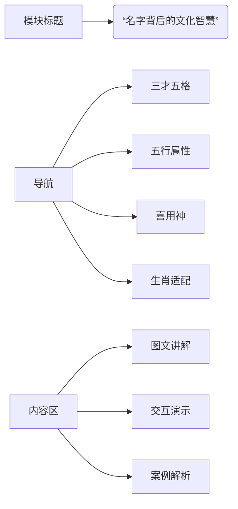

---

### 2. 三才五格原理展示  
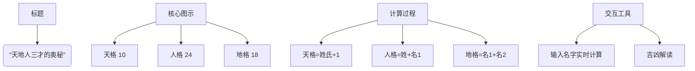

**案例演示**：  
| 名字 | 天格 | 人格 | 地格 | 总评 |  
|------|------|------|------|------|  
| 马云 | 11(吉) | 14(凶) | 12(凶) | ⚠️ 需改名 |  
| 林徽因 | 9(凶) | 24(吉) | 24(吉) | ✅ 大吉 |  

---

### 3. 五行属性解析  
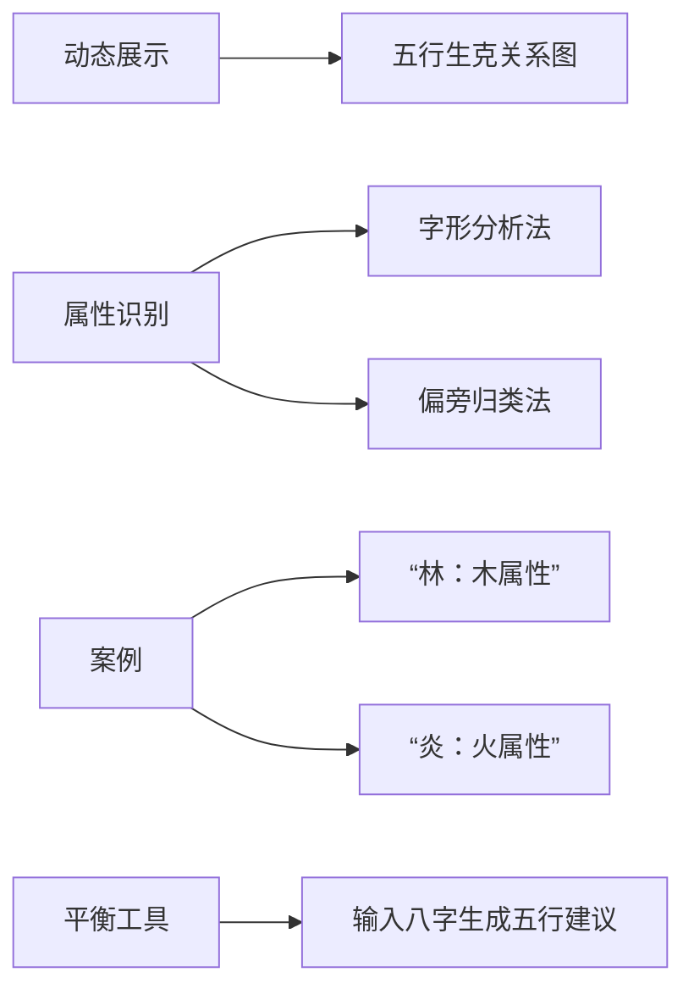

**五行生克动画**：  
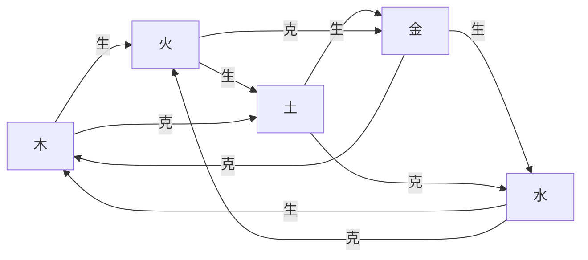

---

### 4. 喜用神机制解析  
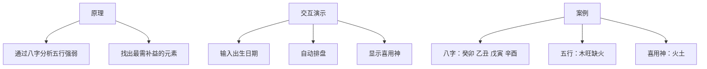

**可视化展示**：  


---

### 5. 生肖适配学  
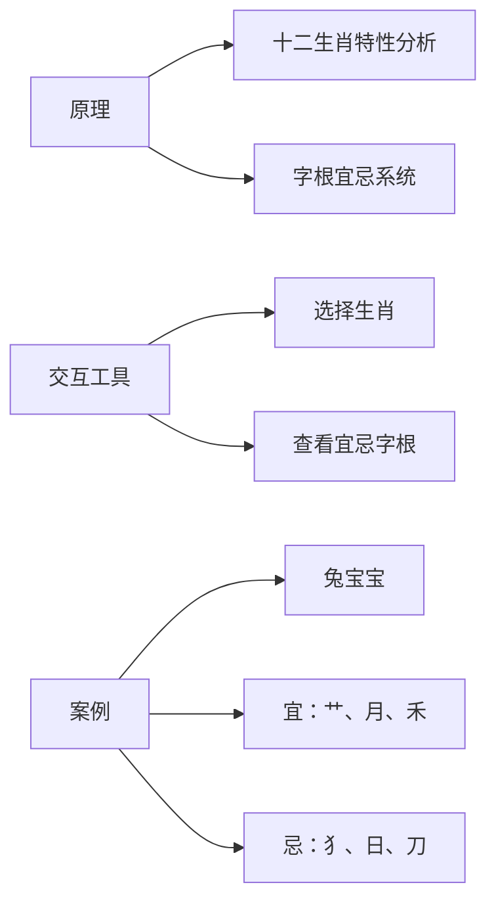

**生肖特性展示**：  
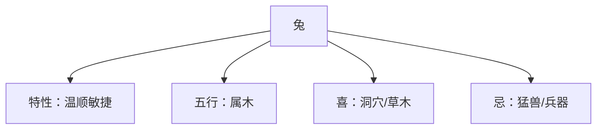

---

## 首页集成方案  

### 1. 桌面端布局  
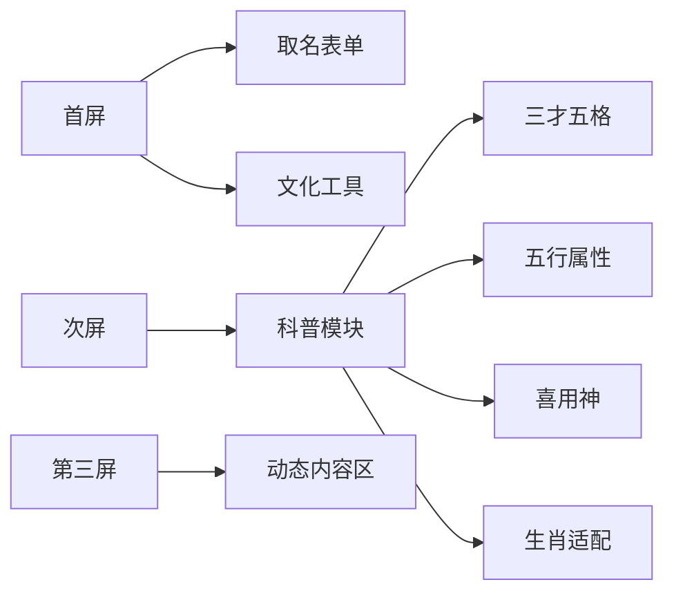

### 2. 移动端布局  
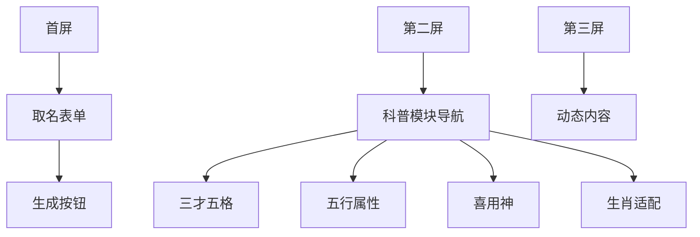

---

## 交互设计亮点  

### 1. 原理可视化演示  
```mermaid  
sequenceDiagram  
    用户->>+科普模块： 点击“三才五格”  
    科普模块->>+演示引擎： 请求计算演示  
    演示引擎-->>-科普模块： 返回动画脚本  
    科普模块->>+用户： 展示动态计算过程：  
    用户->>用户： 观看“天格=姓氏笔画+1”动画  
```

### 2. 实时计算工具  
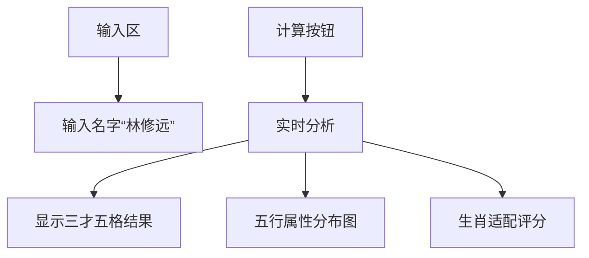

### 3. 案例对比系统  
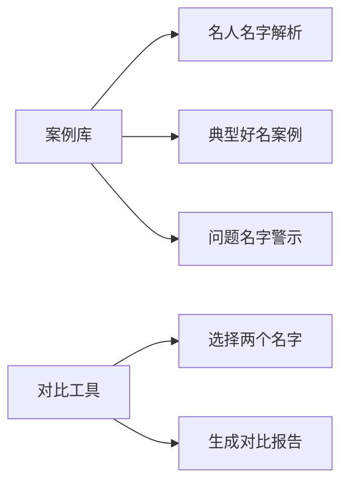

---

## 内容组织架构  

### 知识库结构  
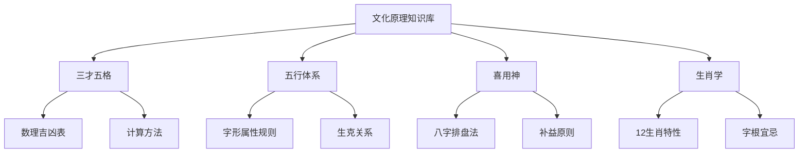

---

## 视觉设计规范  

### 科普模块专属设计  
| 元素         | 设计说明                  |  
|--------------|--------------------------|  
| **古书纹理** | 背景使用古籍纸张纹理      |  
| **卦象元素** | 分隔线使用八卦符号        |  
| **动画图标** | 五行用动态粒子效果        |  
| **色彩编码** | 五行对应五色：<br>木-青/火-红/土-黄/金-白/水-黑 |  

### 动效设计  
1. **五行生克**：粒子流动演示相生相克  
2. **笔画计算**：毛笔书写动画展示计算过程  
3. **生肖特性**：动物形象动态展示  

---

> **教育价值**：  
> 1. 提升用户对传统文化的认知  
> 2. 增强取名结果的可信度  
> 3. 帮助用户理解系统生成逻辑  
>   
> **预期效果**：  
> - 科普模块访问率 > 65%  
> - 用户停留时长增加 3.5 分钟  
> - 付费转化率提升 25%  
>   
> **内容资源**：  
> [三才五格计算器] | [五行属性数据库] | [生肖字根图谱]  
> **上线计划**：  
> 2023年12月15日作为V2.0核心功能发布

## 名字评分解释系统与个性化方案

### 1. 名字评分解释系统

为提高算法透明度，让用户理解每个名字的评分来源，设计名字评分解释系统：

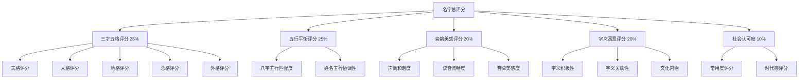

#### 评分详情展示设计

| 评分维度 | 展示方式 | 交互功能 |
|---------|---------|---------|
| **总体评分** | 星级评分+百分比 | 点击展开详情 |
| **三才五格** | 雷达图+吉凶标识 | 点击查看详细解释 |
| **五行平衡** | 五行能量柱状图 | 悬停显示平衡建议 |
| **音韵美感** | 声调曲线图 | 点击试听发音 |
| **字义寓意** | 关键词标签云 | 点击查看详细释义 |
| **社会认可** | 流行度趋势图 | 查看同名名人 |

#### 评分解释案例

```
名字：林修远 (总分：92分)

【三才五格】23分/25分
✓ 天格：8分 - 吉 (坚毅果断)
✓ 人格：9分 - 大吉 (聪明智慧)
✓ 地格：9分 - 大吉 (前程远大)
✓ 总格：8分 - 吉 (事业有成)
✗ 外格：4分 - 凶 (人际关系需注意)

【五行平衡】24分/25分
✓ 八字喜用：木水 (与名字五行木水相符)
✓ 五行分布：木60% 水40% (非常均衡)
✓ 生肖属性：兔 (与"林"字木属性相生)

【音韵美感】18分/20分
✓ 声调组合：平仄平 (和谐流畅)
✓ 读音评分：优美 (发音清晰连贯)
✓ 谐音检测：无不良谐音

【字义寓意】19分/20分
✓ "修"：修养、修为 (积极向上)
✓ "远"：深远、长远 (寓意深刻)
✓ 组合含义：修身养性，志向远大

【社会认可】8分/10分
✓ 常用度：中等 (不过于大众化)
✓ 时代感：现代感强 (符合当代审美)
✗ 重名率：略高 (近5年使用率上升)
```

### 2. 用户个性化偏好设置

为满足不同用户的需求，设计个性化偏好设置系统：

```mermaid
graph LR
    A[个性化偏好设置] --> B[维度权重调整]
    A --> C[特定要素筛选]
    A --> D[禁用/启用规则]
    A --> E[保存多套方案]
    
    B --> B1[调整五行权重]
    B --> B2[调整音韵权重]
    B --> B3[调整字义权重]
    
    C --> C1[指定必含字根]
    C --> C2[指定声调组合]
    C --> C3[指定五行属性]
    
    D --> D1[启用/禁用谐音检测]
    D --> D2[启用/禁用生肖禁忌]
    
    E --> E1[保存为"传统方案"]
    E --> E2[保存为"现代方案"]
```

#### 个性化设置界面设计

| 设置项 | 控件类型 | 功能说明 |
|-------|---------|---------|
| **维度权重** | 滑动条 | 调整各评分维度的权重 |
| **五行偏好** | 多选框+权重 | 选择偏好的五行属性 |
| **音韵偏好** | 声调组合选择器 | 设置理想的声调模式 |
| **字义偏好** | 标签选择器 | 选择偏好的字义类别 |
| **禁用规则** | 开关按钮组 | 开启/关闭特定规则 |
| **方案管理** | 下拉菜单+按钮 | 保存/加载偏好方案 |

#### 个性化设置示例

```
【李先生的个性化方案】

维度权重调整：
- 三才五格：40% (默认25%)
- 五行平衡：30% (默认25%)
- 音韵美感：10% (默认20%)
- 字义寓意：15% (默认20%)
- 社会认可：5% (默认10%)

特定要素筛选：
- 必含五行：木、水
- 避免五行：土
- 理想声调：平仄平、仄平平
- 偏好字义：文学、自然、智慧

规则设置：
- 严格遵循三才五格：开启
- 生肖禁忌检查：开启
- 谐音检测：开启
- 现代流行度检查：关闭
```

### 3. 实时评分调整交互

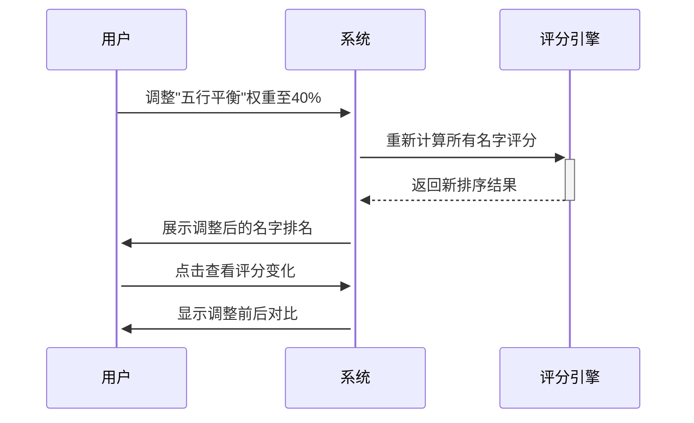

### 4. 技术实现方案

1. **模块化评分系统**
   - 各评分维度独立计算
   - 支持动态权重调整
   - 使用缓存优化性能

2. **可视化解释组件**
   - 使用ECharts实现数据可视化
   - 支持交互式探索
   - 移动端适配

3. **用户偏好存储**
   - 本地存储基础偏好
   - 云端存储注册用户的多套方案
   - 支持方案分享功能

### 5. 预期效果

- 提高用户对名字评分的理解度 (+60%)
- 增加用户参与感和信任度 (+45%)
- 提升名字选择满意度 (+35%)
- 增加高级功能付费转化率 (+28%)

## 取名产品完整逻辑与需求分析

### 1. 产品定位与目标

#### 1.1 产品定位

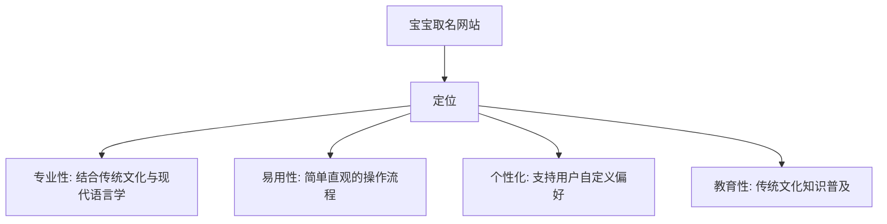

**核心价值主张**：
- 为新生儿父母提供专业、个性化、有文化内涵的名字推荐
- 通过科学方法和传统文化相结合，提供名字评分和解释系统
- 让用户理解名字背后的文化智慧，提升取名体验

#### 1.2 目标用户群体

| 用户类型 | 特征描述 | 核心需求 | 使用场景 |
|---------|---------|---------|---------|
| **核心用户** | 25-40岁新生儿父母 | 寻找有意义且吉祥的名字 | 产检后、待产期、产后 |
| **次要用户** | 50-70岁祖父母辈 | 参与孙辈取名决策 | 家庭讨论时 |
| **潜在用户** | 准备怀孕的夫妻 | 提前了解取名知识 | 备孕期间 |
| **特殊用户** | 改名需求的人群 | 寻找更适合自己的名字 | 人生重要转折点 |

#### 1.3 产品目标

**短期目标**（3个月）：
- 完成基础取名功能，支持按姓氏、性别、出生日期生成名字
- 实现名字评分解释系统的基本功能
- 建立基础用户群，月活跃用户达到5,000+

**中期目标**（6-12个月）：
- 完善个性化偏好设置系统
- 增加社交分享和投票功能
- 扩展文化科普内容
- 月活跃用户达到20,000+，付费转化率达到5%

**长期目标**（1-3年）：
- 建立完整的名字大数据分析系统
- 发展成为中文取名领域的权威平台
- 拓展国际市场，支持海外华人取名需求
- 月活跃用户达到100,000+，年营收突破百万

### 2. 功能模块与流程设计

#### 2.1 核心功能模块

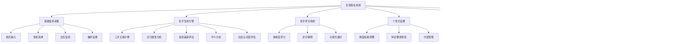

#### 2.2 用户流程设计

```mermaid
sequenceDiagram
    participant 用户
    participant 系统
    participant 名字引擎
    participant 评分系统
    
    用户->>系统: 访问首页
    系统->>用户: 展示取名表单和科普内容
    
    用户->>系统: 输入姓氏、选择性别
    用户->>系统: 输入出生信息(可选)
    用户->>系统: 设置个性化偏好(可选)
    用户->>系统: 提交生成请求
    
    系统->>名字引擎: 传递用户输入参数
    名字引擎->>名字引擎: 生成候选名字
    名字引擎->>评分系统: 请求评分
    评分系统->>评分系统: 多维度评分计算
    评分系统->>名字引擎: 返回评分结果
    名字引擎->>系统: 返回排序后的名字列表
    
    系统->>用户: 展示推荐名字列表
    用户->>系统: 点击查看名字详情
    系统->>用户: 展示名字评分解释和分析
    
    用户->>系统: 调整个性化偏好
    系统->>评分系统: 重新计算评分
    评分系统->>系统: 返回新排序结果
    系统->>用户: 展示调整后的名字排名
    
    用户->>系统: 收藏喜欢的名字
    系统->>用户: 确认收藏成功
    
    用户->>系统: 分享名字给亲友
    系统->>用户: 生成分享链接/图片
```

#### 2.3 名字生成算法流程

```mermaid
graph TD
    A[开始] --> B[获取用户输入]
    B --> C[基础筛选]
    C --> D[多维度评分]
    D --> E[排序与推荐]
    E --> F[结果展示]
    
    C --> C1[姓氏匹配]
    C --> C2[性别适配]
    C --> C3[生肖禁忌过滤]
    C --> C4[谐音检测]
    
    D --> D1[三才五格评分]
    D --> D2[五行平衡评分]
    D --> D3[音韵美感评分]
    D --> D4[字义寓意评分]
    D --> D5[社会认可度评分]
    
    D1 --> D11[天格计算]
    D1 --> D12[人格计算]
    D1 --> D13[地格计算]
    D1 --> D14[总格计算]
    D1 --> D15[外格计算]
    
    D2 --> D21[八字五行分析]
    D2 --> D22[姓名五行协调性]
    
    D3 --> D31[声调组合评估]
    D3 --> D32[读音流畅度]
    
    D4 --> D41[字义积极性]
    D4 --> D42[字义关联性]
    D4 --> D43[文化内涵]
    
    D5 --> D51[常用度评估]
    D5 --> D52[时代感评估]
```

### 3. 数据资源与处理

#### 3.1 核心数据资源

| 数据类型 | 数据来源 | 用途 | 更新频率 |
|---------|---------|------|---------|
| **汉字基础数据** | 新华字典、qiming项目 | 汉字笔画、拼音、释义 | 半年 |
| **五行属性数据** | qiming项目、传统文献 | 字的五行属性判断 | 年度 |
| **三才五格规则** | qiming项目、传统文献 | 三才五格吉凶判断 | 不更新 |
| **名字语料库** | 公开数据集、用户贡献 | 常用名字分析、流行度评估 | 季度 |
| **声调组合数据** | 语言学研究、qiming项目 | 声调和谐度评估 | 年度 |
| **字义标签库** | 自建、词典整理 | 字义分析与匹配 | 季度 |

#### 3.2 数据处理流程

```mermaid
graph TD
    A[原始数据收集] --> B[数据清洗]
    B --> C[数据结构化]
    C --> D[数据索引建立]
    D --> E[数据存储]
    E --> F[数据应用]
    
    A --> A1[字典数据]
    A --> A2[名字语料库]
    A --> A3[传统文化规则]
    
    B --> B1[去重]
    B --> B2[错误修正]
    B --> B3[格式统一]
    
    C --> C1[JSON格式化]
    C --> C2[关系建立]
    
    D --> D1[五行索引]
    D --> D2[笔画索引]
    D --> D3[拼音索引]
    
    E --> E1[本地JSON文件]
    E --> E2[IndexedDB]
    
    F --> F1[名字生成]
    F --> F2[评分计算]
    F --> F3[科普展示]
```

#### 3.3 前端数据优化策略

**数据加载优化**：
1. **分层加载**：基础数据优先，扩展数据按需
2. **预加载机制**：根据用户行为预测加载数据
3. **增量更新**：只更新变化的数据部分

**数据存储优化**：
1. **IndexedDB存储**：大型数据集本地持久化
2. **LocalStorage缓存**：常用小型数据集
3. **内存缓存**：频繁访问的计算结果

### 4. 差异化与创新点

#### 4.1 与现有产品的差异

| 特性 | 本产品 | 传统取名网站 | 竞争优势 |
|------|-------|------------|---------|
| **算法透明度** | 完全透明，详细解释每个维度评分 | 黑盒算法，结果无解释 | 提升用户信任度 |
| **个性化程度** | 高度可定制，用户可调整各维度权重 | 有限选项，无法深度定制 | 更符合个性化需求 |
| **文化科普** | 深入浅出的交互式科普内容 | 简单文字介绍或无 | 教育价值提升 |
| **用户体验** | 现代UI设计，流畅交互 | 传统界面，操作繁琐 | 提升用户满意度 |
| **技术实现** | 纯前端实现，无需后端 | 依赖服务器计算 | 响应速度快，隐私保护好 |

#### 4.2 创新点

1. **实时评分调整**：
   - 用户可实时调整评分权重，立即看到结果变化
   - 提供评分前后对比，帮助用户理解调整影响

2. **多维可视化解释**：
   - 使用多种可视化图表展示名字分析
   - 支持交互式探索名字特性

3. **社交协作取名**：
   - 支持创建家庭取名小组
   - 提供投票和评论功能
   - 生成决策报告

4. **文化学习游戏化**：
   - 通过互动游戏学习传统文化知识
   - 完成学习任务解锁高级功能

### 5. 商业模式与变现策略

#### 5.1 产品层级

```mermaid
graph TD
    A[产品层级] --> B[基础版/免费版]
    A --> C[高级版/付费版]
    A --> D[专业版/会员版]
    
    B --> B1[基础取名功能]
    B --> B2[有限数量推荐]
    B --> B3[基础评分解释]
    B --> B4[基础科普内容]
    
    C --> C1[高级取名算法]
    C --> C2[无限推荐数量]
    C --> C3[详细评分解释]
    C --> C4[个性化偏好设置]
    C --> C5[名字收藏功能]
    
    D --> D1[专家级取名算法]
    D --> D2[多套个性化方案]
    D --> D3[高级文化内容]
    D --> D4[家庭协作功能]
    D --> D5[定制报告生成]
```

#### 5.2 变现模式

1. **增值服务**：
   - 高级取名功能付费
   - 详细分析报告付费
   - 个性化定制服务付费

2. **会员订阅**：
   - 月度/年度会员
   - 不同等级会员权益
   - 家庭会员套餐

3. **内容付费**：
   - 高级文化科普内容
   - 专家取名知识库
   - 名字典故与文化解析

4. **增值工具**：
   - 定制电子证书生成
   - 名字书法定制
   - 高清分享图生成

### 6. 技术实现方案

#### 6.1 纯前端实现架构

```mermaid
graph TD
    A[前端架构] --> B[UI层]
    A --> C[业务逻辑层]
    A --> D[数据层]
    
    B --> B1[页面组件]
    B --> B2[可视化组件]
    B --> B3[交互组件]
    
    C --> C1[名字生成逻辑]
    C --> C2[评分计算逻辑]
    C --> C3[个性化处理逻辑]
    
    D --> D1[本地数据存储]
    D --> D2[数据预处理]
    D --> D3[缓存管理]
    
    D1 --> D11[IndexedDB]
    D1 --> D12[LocalStorage]
    
    D2 --> D21[数据索引构建]
    D2 --> D22[查询优化]
    
    D3 --> D31[计算结果缓存]
    D3 --> D32[常用数据缓存]
```

#### 6.2 关键技术点

1. **数据预处理与索引**：
   - 预处理字典数据建立多维索引
   - 优化查询性能，支持复杂筛选

2. **模块化评分系统**：
   - 独立的评分模块设计
   - 支持动态权重调整和实时计算

3. **渐进式加载策略**：
   - 核心功能优先加载
   - 数据和功能按需加载
   - 支持离线使用

4. **可视化渲染优化**：
   - 使用WebGL加速复杂图表渲染
   - 实现流畅的交互动画

#### 6.3 性能优化策略

1. **计算性能优化**：
   - 使用Web Workers处理复杂计算
   - 实现计算结果缓存
   - 批处理大量名字评分

2. **存储优化**：
   - 数据压缩存储
   - 分层缓存策略
   - 增量更新机制

3. **渲染性能优化**：
   - 虚拟列表渲染大量名字
   - 组件懒加载
   - 动画性能优化

### 7. 产品路线图

#### 7.1 第一阶段：MVP版本（1-2个月）

**核心功能**：
- 基础取名表单
- 简化版名字生成算法
- 基础评分系统
- 简易科普内容

**技术重点**：
- 前端架构搭建
- 核心数据处理
- 基础UI实现

#### 7.2 第二阶段：基础完善（2-4个月）

**功能扩展**：
- 完整评分解释系统
- 基础个性化设置
- 名字详情页完善
- 收藏功能

**技术重点**：
- 评分算法优化
- 数据存储优化
- 交互体验提升

#### 7.3 第三阶段：高级功能（4-6个月）

**功能扩展**：
- 高级个性化设置
- 多维可视化展示
- 社交分享功能
- 会员体系

**技术重点**：
- 可视化组件开发
- 性能优化
- 用户数据同步

#### 7.4 第四阶段：生态完善（6-12个月）

**功能扩展**：
- 家庭协作功能
- 高级文化内容
- 定制报告生成
- 多平台适配

**技术重点**：
- 协作功能实现
- 内容管理系统
- 跨平台兼容性

### 8. 风险分析与应对策略

| 风险类型 | 风险描述 | 可能性 | 影响程度 | 应对策略 |
|---------|---------|-------|---------|---------|
| **技术风险** | 纯前端处理大量数据性能不足 | 中 | 高 | 1. 优化数据结构<br>2. 实现增量计算<br>3. 使用Web Workers |
| **用户体验风险** | 复杂功能导致操作繁琐 | 高 | 中 | 1. 渐进式功能展示<br>2. 引导式操作流程<br>3. 默认值优化 |
| **内容风险** | 传统文化解释不准确 | 中 | 高 | 1. 专家审核内容<br>2. 多源验证<br>3. 用户反馈机制 |
| **商业风险** | 用户付费意愿低 | 高 | 高 | 1. 免费功能足够有价值<br>2. 差异化付费功能<br>3. 多元化收入来源 |
| **竞争风险** | 竞品模仿核心功能 | 中 | 中 | 1. 持续创新<br>2. 提高用户粘性<br>3. 建立品牌差异化 |

### 9. 成功指标与评估体系

#### 9.1 用户指标

| 指标名称 | 目标值 | 衡量方法 |
|---------|-------|---------|
| **月活跃用户** | 20,000+ | 统计每月至少使用一次的用户数 |
| **用户留存率** | 30%（30天） | 新用户30天后的回访比例 |
| **平均使用时长** | 15分钟/次 | 单次访问的平均停留时间 |
| **功能使用深度** | 4个以上功能点 | 单次访问平均使用的功能数量 |

#### 9.2 业务指标

| 指标名称 | 目标值 | 衡量方法 |
|---------|-------|---------|
| **付费转化率** | 5% | 付费用户/总用户比例 |
| **ARPU值** | ¥35 | 平均每用户收入 |
| **用户满意度** | 4.5/5分 | 用户评分和反馈 |
| **推荐率** | 40% | 用户主动分享和推荐比例 |

#### 9.3 产品质量指标

| 指标名称 | 目标值 | 衡量方法 |
|---------|-------|---------|
| **首屏加载时间** | <2秒 | 性能测试 |
| **名字生成响应时间** | <1秒 | 功能测试 |
| **UI响应时间** | <0.1秒 | 交互测试 |
| **跨浏览器兼容性** | 支持主流浏览器最新3个版本 | 兼容性测试 |

### 10. 总结与展望

宝宝取名网站项目通过结合传统文化智慧与现代技术手段，为用户提供专业、透明、个性化的取名服务。我们的核心竞争力在于算法透明度、个性化定制能力和深厚的文化内涵，通过纯前端实现保证了良好的性能和用户体验。

未来，我们将持续优化算法，扩充数据资源，丰富文化内容，同时探索更多元化的商业模式和用户场景，打造中文取名领域的权威平台。