# 宝宝取名网站产品设计文档

## 文档信息

| 字段 | 内容 |
|------|------|
| **文档版本** | v1.0 |
| **创建日期** | 2024年1月 |
| **最后更新** | 2024年1月 |
| **文档状态** | 最终版 |
| **编写人员** | 产品团队 |

---

## 目录

1. [产品概述](#产品概述)
2. [市场分析与用户研究](#市场分析与用户研究)
3. [产品定位与价值主张](#产品定位与价值主张)
4. [功能设计与用户体验](#功能设计与用户体验)
5. [技术架构与实现方案](#技术架构与实现方案)
6. [商业模式与运营策略](#商业模式与运营策略)
7. [项目规划与里程碑](#项目规划与里程碑)
8. [风险评估与应对策略](#风险评估与应对策略)
9. [成功指标与评估体系](#成功指标与评估体系)

---

## 产品概述

### 1.1 产品简介

**宝宝取名网站**是一个基于传统文化智慧与现代技术相结合的专业取名平台，为新生儿父母提供科学、个性化、有文化内涵的名字推荐服务。

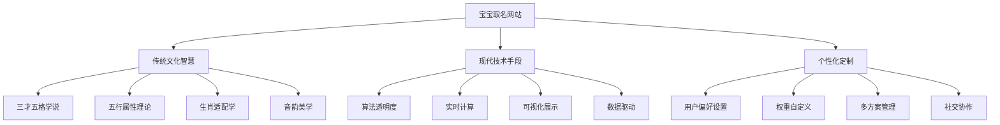

### 1.2 核心价值主张

1. **专业性**：结合传统文化与现代语言学，提供科学的名字评分体系
2. **透明度**：完全透明的算法解释，让用户理解每个评分的来源
3. **个性化**：高度可定制的偏好设置，满足不同用户的独特需求
4. **教育性**：深入浅出的文化科普，提升用户对传统文化的认知
5. **便捷性**：纯前端实现，快速响应，无需服务器依赖

### 1.3 产品特色

| 特色功能 | 详细说明 | 竞争优势 |
|---------|---------|---------|
| **算法透明化** | 详细解释每个维度的评分依据 | 提升用户信任度和参与感 |
| **实时权重调整** | 用户可动态调整评分权重 | 真正的个性化定制体验 |
| **多维可视化** | 雷达图、柱状图等多种展示方式 | 直观理解名字特性 |
| **文化科普系统** | 交互式学习传统取名知识 | 教育价值与实用性并重 |
| **纯前端实现** | 无需后端，快速响应 | 隐私保护好，性能优异 |

---

## 市场分析与用户研究

### 2.1 市场概况

**市场规模**：
- 中国每年新生儿约1,000万人
- 取名服务市场规模约50亿元
- 在线取名市场增长率约30%/年

**市场痛点**：
- 传统取名方式效率低，依赖专家
- 现有在线工具算法不透明，结果难以理解
- 个性化程度不足，无法满足多样化需求
- 文化教育价值缺失

### 2.2 目标用户分析

#### 核心用户群体

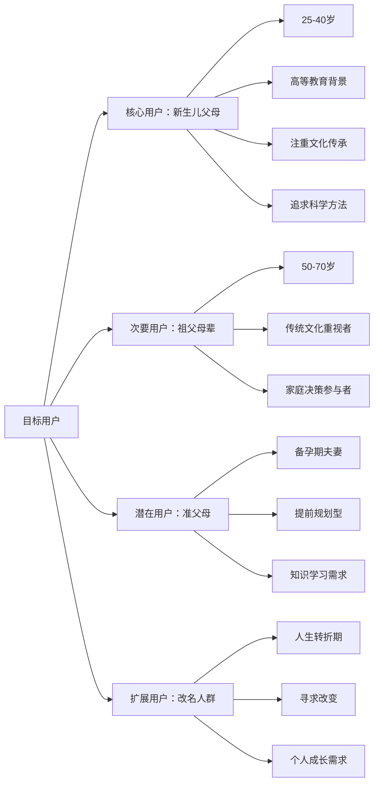

#### 用户画像详情

| 用户类型 | 年龄范围 | 核心特征 | 主要需求 | 使用场景 |
|---------|---------|---------|---------|---------|
| **都市新父母** | 25-35岁 | 高学历、重视科学育儿 | 寻找有意义且现代的名字 | 孕期规划、产后取名 |
| **传统文化爱好者** | 30-45岁 | 注重文化传承和寓意 | 深度了解名字文化内涵 | 家庭讨论、文化学习 |
| **长辈参与者** | 50-70岁 | 经验丰富、重视传统 | 参与孙辈取名决策 | 家庭会议、代际沟通 |
| **理性决策者** | 28-40岁 | 数据驱动、追求完美 | 多方案对比和科学分析 | 深度研究、反复比较 |

### 2.3 竞品分析

| 竞品 | 优势 | 劣势 | 我们的差异化 |
|------|------|------|------------|
| **传统取名网站** | 功能完整，数据丰富 | 算法黑盒，用户体验差 | 算法透明，现代UI |
| **命理师服务** | 专业权威，个性化强 | 费用高，效率低 | 自助服务，性价比高 |
| **手机APP** | 便携性好，操作简单 | 功能单一，深度不足 | 功能深度，教育价值 |
| **社交平台群组** | 互动性强，口碑传播 | 专业性不足，质量参差 | 专业+社交的结合 |

---

## 产品定位与价值主张

### 3.1 产品定位

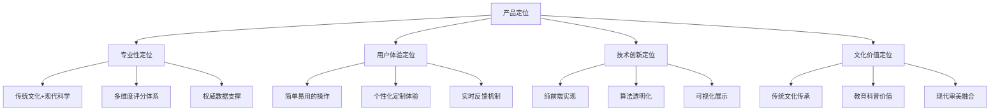

### 3.2 差异化竞争策略

#### 3.2.1 核心差异点

1. **算法透明度革命**
   - 完全公开评分逻辑
   - 详细解释每个维度
   - 用户可验证计算过程

2. **个性化定制深度**
   - 权重自由调整
   - 多套方案管理
   - 实时效果预览

3. **文化教育价值**
   - 交互式文化科普
   - 深度内容体系
   - 寓教于乐的体验

4. **技术实现创新**
   - 纯前端架构
   - 快速响应体验
   - 隐私保护优势

#### 3.2.2 创新功能设计

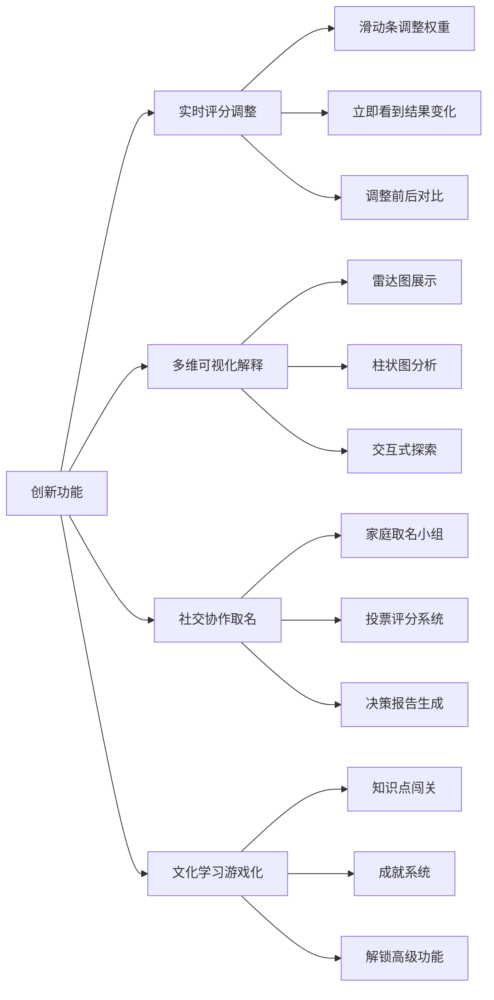

---

## 功能设计与用户体验

### 4.1 产品功能架构

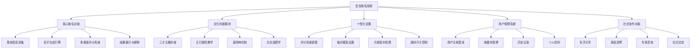

### 4.2 核心功能详细设计

#### 4.2.1 智能取名引擎

**名字生成流程**：

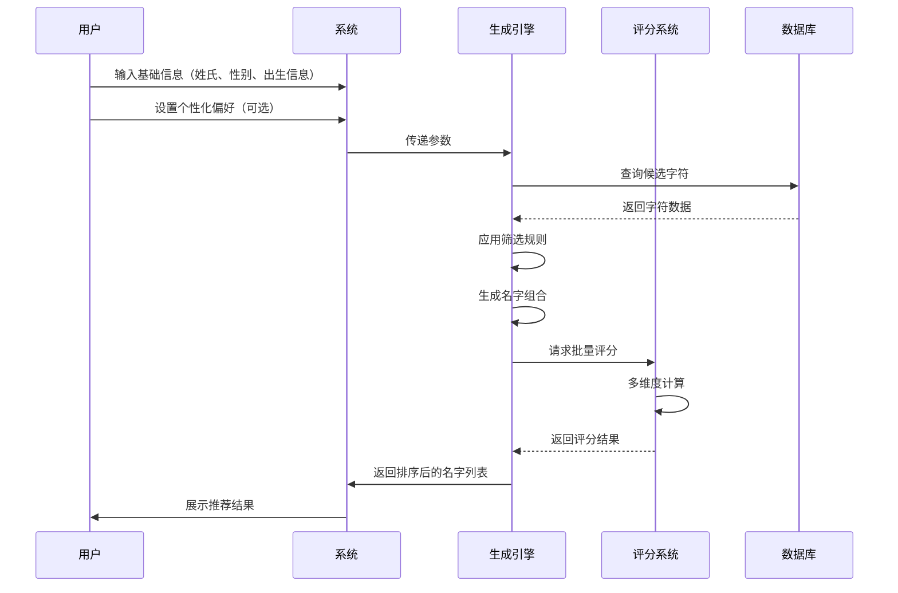

**评分系统架构**：

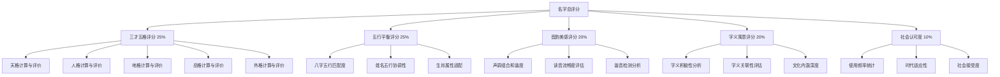

#### 4.2.2 评分解释系统

**可视化展示设计**：

| 评分维度 | 展示方式 | 交互功能 | 详细说明 |
|---------|---------|---------|---------|
| **总体评分** | 星级评分+进度条 | 点击展开详情 | 显示总分及各维度权重 |
| **三才五格** | 雷达图+吉凶标识 | 悬停查看计算过程 | 五个维度的雷达图展示 |
| **五行平衡** | 五行能量柱状图 | 点击查看平衡建议 | 动态展示五行能量分布 |
| **音韵美感** | 声调曲线图 | 点击试听发音 | 声调组合的可视化 |
| **字义寓意** | 关键词标签云 | 点击查看详细释义 | 字义关键词热力图 |
| **社会认可** | 流行度趋势图 | 查看同名名人案例 | 历史流行度变化趋势 |

#### 4.2.3 个性化偏好系统

**偏好设置界面**：

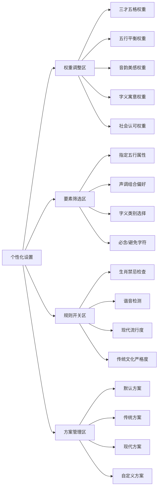

### 4.3 文化科普模块设计

#### 4.3.1 科普内容架构

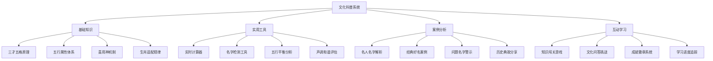

#### 4.3.2 交互设计亮点

**三才五格原理展示**：

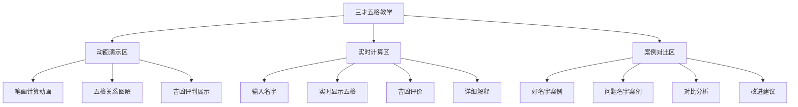

### 4.4 用户体验设计

#### 4.4.1 界面设计原则

1. **简洁性**：界面布局清晰，信息层次分明
2. **一致性**：统一的设计语言和交互模式
3. **响应性**：快速反馈，流畅的交互体验
4. **可访问性**：支持多种用户需求和使用场景
5. **教育性**：寓教于乐，提升文化认知

#### 4.4.2 交互流程优化

**核心用户路径**：

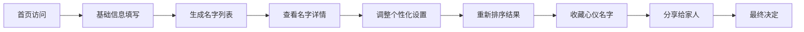

**优化策略**：
- 减少必填项，提供智能默认值
- 渐进式功能展示，避免信息过载
- 提供引导提示和操作帮助
- 实时保存用户操作，防止数据丢失

---

## 技术架构与实现方案

### 5.1 技术选型与架构

#### 5.1.1 前端技术栈

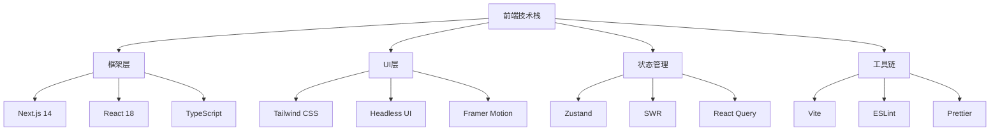

#### 5.1.2 系统架构设计

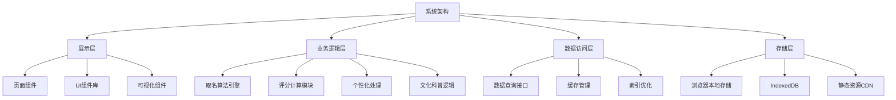

### 5.2 核心算法实现

#### 5.2.1 名字生成算法

```typescript
interface NameGenerationConfig {
  familyName: string;
  gender: 'male' | 'female' | 'neutral';
  birthDate?: Date;
  preferences: UserPreferences;
  constraints: NameConstraints;
}

interface UserPreferences {
  weights: {
    sancai: number;      // 三才五格权重
    wuxing: number;      // 五行平衡权重
    sound: number;       // 音韵美感权重
    meaning: number;     // 字义寓意权重
    social: number;      // 社会认可权重
  };
  requiredElements?: string[];  // 必含五行
  avoidedElements?: string[];   // 避免五行
  preferredTones?: number[][];  // 偏好声调组合
  meaningCategories?: string[]; // 字义类别偏好
}

class NameGenerator {
  private characterData: CharacterDatabase;
  private sancaiRules: SancaiRules;
  private wuxingData: WuxingDatabase;
  
  async generateNames(config: NameGenerationConfig): Promise<ScoredName[]> {
    // 1. 基础筛选
    const candidates = await this.getBasicCandidates(config);
    
    // 2. 应用约束条件
    const filtered = this.applyConstraints(candidates, config.constraints);
    
    // 3. 生成名字组合
    const combinations = this.generateCombinations(filtered, config.familyName);
    
    // 4. 多维度评分
    const scored = await Promise.all(
      combinations.map(name => this.scoreComprehensively(name, config))
    );
    
    // 5. 排序和筛选
    return this.rankAndFilter(scored, config.preferences);
  }
}
```

#### 5.2.2 评分系统实现

```typescript
interface ScoreResult {
  total: number;
  breakdown: {
    sancai: SancaiScore;
    wuxing: WuxingScore;
    sound: SoundScore;
    meaning: MeaningScore;
    social: SocialScore;
  };
  explanation: ScoreExplanation;
}

class ComprehensiveScorer {
  async scoreComprehensively(
    name: NameCandidate, 
    config: NameGenerationConfig
  ): Promise<ScoreResult> {
    const scores = await Promise.all([
      this.scoreSancai(name),
      this.scoreWuxing(name, config.birthDate),
      this.scoreSound(name),
      this.scoreMeaning(name),
      this.scoreSocial(name)
    ]);
    
    const weighted = this.applyWeights(scores, config.preferences.weights);
    
    return {
      total: weighted.total,
      breakdown: weighted.breakdown,
      explanation: this.generateExplanation(scores, weighted)
    };
  }
  
  private async scoreSancai(name: NameCandidate): Promise<SancaiScore> {
    const strokes = this.calculateStrokes(name);
    const grids = this.calculateGrids(strokes);
    const sancai = this.calculateSancai(grids);
    
    return {
      score: this.evaluateSancai(sancai),
      grids,
      sancai,
      details: this.getSancaiDetails(sancai)
    };
  }
}
```

### 5.3 数据管理策略

#### 5.3.1 数据结构设计

```typescript
// 字符数据结构
interface Character {
  char: string;
  pinyin: string;
  tone: number;
  strokes: {
    simplified: number;
    traditional: number;
  };
  wuxing: WuxingElement;
  meanings: string[];
  gender: 'male' | 'female' | 'neutral';
  frequency: number;
  culturalLevel: number;
}

// 三才五格规则
interface SancaiRule {
  combination: [WuxingElement, WuxingElement, WuxingElement];
  level: 'excellent' | 'good' | 'fair' | 'poor' | 'bad';
  description: string;
  characteristics: string[];
}

// 用户偏好数据
interface UserProfile {
  id: string;
  preferences: UserPreferences[];
  favorites: string[];
  history: NameSearchHistory[];
  achievements: Achievement[];
}
```

#### 5.3.2 性能优化策略

**数据加载优化**：

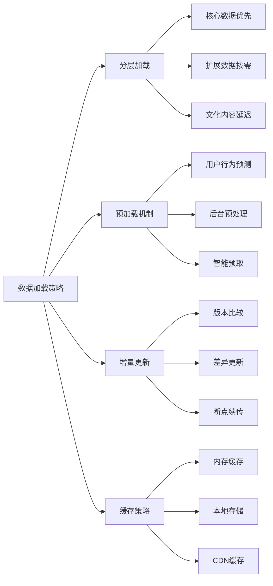

**计算性能优化**：

```typescript
class OptimizedCalculator {
  private cache = new Map<string, ScoreResult>();
  private worker?: Worker;
  
  constructor() {
    // 初始化Web Worker用于复杂计算
    this.worker = new Worker('/workers/name-calculator.js');
  }
  
  async calculateBatch(names: NameCandidate[]): Promise<ScoreResult[]> {
    // 检查缓存
    const cachedResults = names.map(name => 
      this.cache.get(this.getCacheKey(name))
    );
    
    // 筛选需要计算的名字
    const needCalculation = names.filter((_, index) => 
      !cachedResults[index]
    );
    
    // 批量计算
    if (needCalculation.length > 0) {
      const newResults = await this.workerCalculate(needCalculation);
      
      // 更新缓存
      needCalculation.forEach((name, index) => {
        this.cache.set(this.getCacheKey(name), newResults[index]);
      });
    }
    
    // 合并结果
    return this.mergeResults(cachedResults, names);
  }
}
```

---

## 商业模式与运营策略

### 6.1 商业模式设计

#### 6.1.1 产品层级

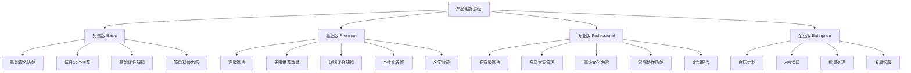

#### 6.1.2 收入模式

| 收入来源 | 定价策略 | 目标用户 | 预期占比 |
|---------|---------|---------|---------|
| **订阅会员** | ¥29/月，¥298/年 | 核心用户群 | 60% |
| **单次付费** | ¥9.9-39.9/次 | 偶发需求用户 | 25% |
| **增值服务** | ¥99-299/项 | 高端用户 | 10% |
| **合作分成** | 平台分成20-30% | B端客户 | 5% |

### 6.2 运营策略

#### 6.2.1 用户获取策略

**多渠道获客**：

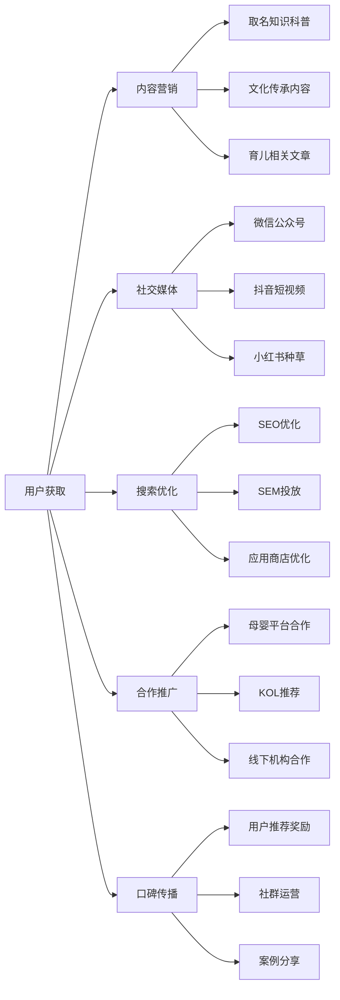

#### 6.2.2 用户留存策略

**留存提升计划**：

1. **功能粘性**：
   - 个性化推荐优化
   - 历史记录和收藏功能
   - 进度保存和多设备同步

2. **内容价值**：
   - 定期更新文化科普内容
   - 推出专题学习系列
   - 提供取名趋势报告

3. **社交互动**：
   - 用户社区建设
   - 专家在线答疑
   - 成功案例分享

4. **个性化服务**：
   - 基于行为的智能推荐
   - 节日主题特色服务
   - 生日提醒和纪念功能

#### 6.2.3 商业化路径

**分阶段商业化**：

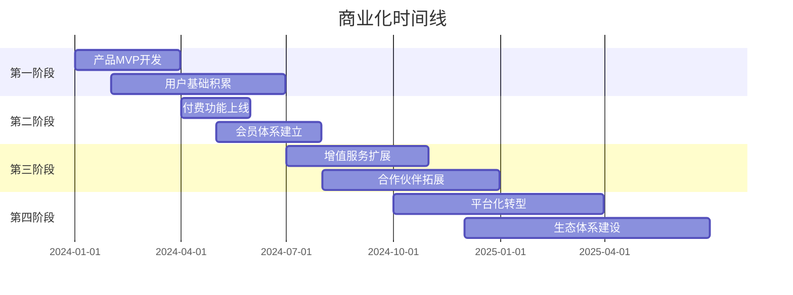

---

## 项目规划与里程碑

### 7.1 开发计划

#### 7.1.1 开发阶段划分

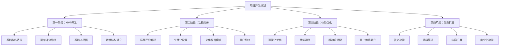

#### 7.1.2 详细时间规划

| 阶段 | 时间周期 | 主要目标 | 关键里程碑 | 团队规模 |
|------|---------|---------|------------|----------|
| **第一阶段** | 1-3月 | MVP产品上线 | 核心功能可用，初始用户反馈 | 3-4人 |
| **第二阶段** | 4-6月 | 功能完善 | 付费功能上线，用户增长 | 5-6人 |
| **第三阶段** | 7-9月 | 体验优化 | 用户留存提升，口碑建立 | 6-8人 |
| **第四阶段** | 10-12月 | 生态建设 | 商业化成功，平台化转型 | 8-10人 |

### 7.2 技术里程碑

#### 7.2.1 关键技术节点

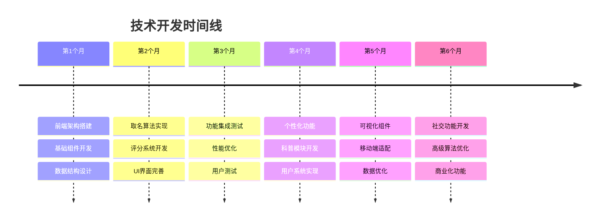

### 7.3 团队组织结构

#### 7.3.1 核心团队构成

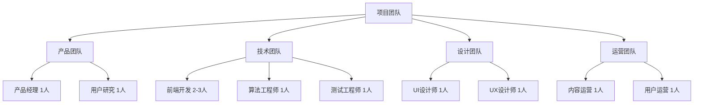

#### 7.3.2 关键岗位职责

| 岗位 | 主要职责 | 技能要求 | 配置时间 |
|------|---------|---------|---------|
| **产品经理** | 需求分析、产品规划、项目协调 | 互联网产品经验、用户思维 | 全程 |
| **前端Lead** | 技术架构、代码质量、团队管理 | React/Next.js专家、架构能力 | 全程 |
| **算法工程师** | 取名算法、评分系统、性能优化 | 算法能力、JavaScript熟练 | 前期重点 |
| **UI/UX设计师** | 界面设计、交互设计、用户体验 | 设计工具熟练、用户体验理念 | 前中期重点 |

---

## 风险评估与应对策略

### 8.1 风险识别与分析

#### 8.1.1 风险矩阵

```mermaid
graph TD
    A[项目风险] --> B[技术风险]
    A --> C[市场风险]
    A --> D[运营风险]
    A --> E[财务风险]
    
    B --> B1[高 - 性能瓶颈]
    B --> B2[中 - 技术难度]
    B --> B3[低 - 兼容性问题]
    
    C --> C1[高 - 竞争加剧]
    C --> C2[中 - 用户接受度]
    C --> C3[低 - 市场变化]
    
    D --> D1[中 - 内容质量]
    D --> D2[中 - 用户增长]
    D --> D3[高 - 团队能力]
    
    E --> E1[中 - 资金短缺]
    E --> E2[低 - 收入模式]
    E --> E3[中 - 成本控制]
```

#### 8.1.2 详细风险分析

| 风险类型 | 风险描述 | 概率 | 影响 | 风险等级 |
|---------|---------|------|------|---------|
| **性能瓶颈** | 前端处理大量数据导致卡顿 | 中 | 高 | 🔴 高风险 |
| **竞争加剧** | 大厂推出类似产品 | 高 | 高 | 🔴 高风险 |
| **团队能力** | 关键人员离职或能力不足 | 中 | 高 | 🟡 中风险 |
| **用户接受度** | 目标用户不买账产品理念 | 中 | 中 | 🟡 中风险 |
| **内容质量** | 文化内容不够准确权威 | 中 | 中 | 🟡 中风险 |
| **资金短缺** | 资金链断裂导致项目中止 | 低 | 高 | 🟡 中风险 |

### 8.2 风险应对策略

#### 8.2.1 技术风险应对

**性能优化方案**：

```typescript
// 1. 数据分片加载
class DataManager {
  async loadDataInChunks(chunkSize: number = 1000) {
    const chunks = this.splitIntoChunks(this.rawData, chunkSize);
    
    for (const chunk of chunks) {
      await this.processChunk(chunk);
      // 让出主线程，避免阻塞UI
      await this.yield();
    }
  }
  
  private yield(): Promise<void> {
    return new Promise(resolve => setTimeout(resolve, 0));
  }
}

// 2. Web Workers使用
class CalculationWorker {
  private worker: Worker;
  
  constructor() {
    this.worker = new Worker('/workers/calculation.js');
  }
  
  async calculate(data: any[]): Promise<any[]> {
    return new Promise((resolve, reject) => {
      this.worker.postMessage(data);
      this.worker.onmessage = (e) => resolve(e.data);
      this.worker.onerror = reject;
    });
  }
}

// 3. 结果缓存机制
class CacheManager {
  private cache = new Map<string, any>();
  private maxSize = 1000;
  
  get(key: string): any {
    return this.cache.get(key);
  }
  
  set(key: string, value: any): void {
    if (this.cache.size >= this.maxSize) {
      const firstKey = this.cache.keys().next().value;
      this.cache.delete(firstKey);
    }
    this.cache.set(key, value);
  }
}
```

#### 8.2.2 市场风险应对

**竞争策略**：

1. **技术壁垒建设**：
   - 持续优化算法精度
   - 建立专有数据库
   - 申请相关技术专利

2. **用户粘性提升**：
   - 深度个性化服务
   - 社区生态建设
   - 文化教育价值

3. **快速迭代能力**：
   - 敏捷开发模式
   - 用户反馈快速响应
   - 功能快速上线

#### 8.2.3 运营风险应对

**内容质量保证**：

```mermaid
graph LR
    A[内容质量控制] --> B[专家审核]
    A --> C[用户反馈]
    A --> D[同行评议]
    A --> E[持续更新]
    
    B --> B1[文化专家团队]
    B --> B2[语言学专家]
    B --> B3[命理学顾问]
    
    C --> C1[用户纠错机制]
    C --> C2[评分系统]
    C --> C3[意见收集]
    
    D --> D1[行业专家评估]
    D --> D2[学术机构合作]
    D --> D3[权威媒体报道]
    
    E --> E1[定期内容review]
    E --> E2[最新研究跟进]
    E --> E3[用户需求更新]
```

---

## 成功指标与评估体系

### 9.1 关键绩效指标(KPI)

#### 9.1.1 用户指标

```mermaid
graph TD
    A[用户指标] --> B[获取指标]
    A --> C[活跃指标]
    A --> D[留存指标]
    A --> E[满意指标]
    
    B --> B1[新用户注册数]
    B --> B2[日访问用户数]
    B --> B3[获客成本CAC]
    
    C --> C1[日活跃用户DAU]
    C --> C2[月活跃用户MAU]
    C --> C3[用户使用时长]
    
    D --> D1[次日留存率]
    D --> D2[7日留存率]
    D --> D3[30日留存率]
    
    E --> E1[用户满意度评分]
    E --> E2[NPS推荐指数]
    E --> E3[功能使用深度]
```

| 指标类别 | 指标名称 | 目标值 | 衡量方法 | 统计周期 |
|---------|---------|-------|---------|---------|
| **用户获取** | 新用户注册 | 500+/月 | 注册统计 | 月度 |
| **用户活跃** | 月活跃用户 | 20,000+ | 登录统计 | 月度 |
| **用户留存** | 30日留存率 | 30%+ | 回访统计 | 月度 |
| **用户满意** | 用户评分 | 4.5/5+ | 评分收集 | 季度 |

#### 9.1.2 业务指标

```mermaid
graph TD
    A[业务指标] --> B[收入指标]
    A --> C[转化指标]
    A --> D[成本指标]
    A --> E[效率指标]
    
    B --> B1[月度营收MRR]
    B --> B2[用户生命价值LTV]
    B --> B3[平均客单价ARPU]
    
    C --> C1[免费到付费转化率]
    C --> C2[功能使用转化率]
    C --> C3[推荐转化率]
    
    D --> D1[用户获客成本CAC]
    D --> D2[运营成本]
    D --> D3[技术成本]
    
    E --> E1[客服响应时间]
    E --> E2[bug修复时间]
    E --> E3[功能开发周期]
```

| 指标类别 | 指标名称 | 目标值 | 计算公式 | 优化方向 |
|---------|---------|-------|---------|---------|
| **收入增长** | 月度营收增长率 | 20%+ | (本月营收-上月营收)/上月营收 | 持续增长 |
| **用户价值** | LTV/CAC比值 | 3:1+ | 用户生命价值/获客成本 | 比值提升 |
| **转化效率** | 付费转化率 | 5%+ | 付费用户/总用户 | 转化提升 |
| **成本控制** | 运营成本占比 | <30% | 运营成本/总营收 | 成本降低 |

#### 9.1.3 产品质量指标

| 指标类别 | 指标名称 | 目标值 | 测试方法 | 监控频率 |
|---------|---------|-------|---------|---------|
| **性能指标** | 首屏加载时间 | <2秒 | 性能测试工具 | 持续监控 |
| **稳定性** | 系统可用性 | 99.9%+ | 错误监控 | 实时监控 |
| **兼容性** | 浏览器支持 | 95%+ | 兼容性测试 | 版本发布前 |
| **用户体验** | 任务完成率 | 90%+ | 用户测试 | 月度测试 |

### 9.2 数据监控体系

#### 9.2.1 数据埋点策略

```typescript
// 用户行为埋点
interface UserEvent {
  eventType: string;
  userId: string;
  timestamp: number;
  parameters: Record<string, any>;
}

class AnalyticsTracker {
  // 页面访问埋点
  trackPageView(page: string) {
    this.track('page_view', {
      page,
      referrer: document.referrer,
      userAgent: navigator.userAgent
    });
  }
  
  // 功能使用埋点
  trackFeatureUsage(feature: string, action: string, value?: any) {
    this.track('feature_usage', {
      feature,
      action,
      value,
      sessionId: this.getSessionId()
    });
  }
  
  // 转化行为埋点
  trackConversion(type: string, step: number, success: boolean) {
    this.track('conversion', {
      type,
      step,
      success,
      conversionPath: this.getConversionPath()
    });
  }
}

// 业务指标计算
class BusinessMetrics {
  // 计算用户留存率
  calculateRetentionRate(startDate: Date, endDate: Date): number {
    const newUsers = this.getNewUsers(startDate);
    const retainedUsers = this.getRetainedUsers(newUsers, endDate);
    return retainedUsers.length / newUsers.length;
  }
  
  // 计算LTV
  calculateLTV(userId: string): number {
    const userRevenue = this.getUserTotalRevenue(userId);
    const userLifespan = this.getUserLifespan(userId);
    return userRevenue / userLifespan;
  }
}
```

#### 9.2.2 监控面板设计

```mermaid
graph TD
    A[数据监控面板] --> B[实时监控]
    A --> C[业务分析]
    A --> D[用户行为]
    A --> E[性能监控]
    
    B --> B1[当前在线用户]
    B --> B2[实时收入统计]
    B --> B3[系统状态监控]
    
    C --> C1[日/月营收趋势]
    C --> C2[用户增长曲线]
    C --> C3[转化漏斗分析]
    
    D --> D1[用户路径分析]
    D --> D2[功能使用热图]
    D --> D3[用户画像分析]
    
    E --> E1[页面加载性能]
    E --> E2[接口响应时间]
    E --> E3[错误率统计]
```

### 9.3 持续优化机制

#### 9.3.1 A/B测试框架

```typescript
interface ABTestConfig {
  testId: string;
  variants: {
    name: string;
    weight: number;
    config: any;
  }[];
  metrics: string[];
  duration: number;
}

class ABTestManager {
  private tests = new Map<string, ABTestConfig>();
  
  // 创建A/B测试
  createTest(config: ABTestConfig) {
    this.tests.set(config.testId, config);
    this.startTest(config.testId);
  }
  
  // 获取用户分组
  getUserVariant(testId: string, userId: string): string {
    const test = this.tests.get(testId);
    if (!test) return 'control';
    
    const hash = this.hashUserId(userId);
    const random = hash % 100;
    
    let cumulative = 0;
    for (const variant of test.variants) {
      cumulative += variant.weight;
      if (random < cumulative) {
        return variant.name;
      }
    }
    
    return 'control';
  }
  
  // 记录测试结果
  recordMetric(testId: string, userId: string, metric: string, value: number) {
    const variant = this.getUserVariant(testId, userId);
    this.analytics.track('ab_test_metric', {
      testId,
      variant,
      metric,
      value,
      userId
    });
  }
}
```

#### 9.3.2 优化决策流程

```mermaid
sequenceDiagram
    participant 数据监控
    participant 分析团队
    participant 产品团队
    participant 开发团队
    participant 用户测试
    
    数据监控->>分析团队: 发现异常指标
    分析团队->>分析团队: 深度数据分析
    分析团队->>产品团队: 提供优化建议
    产品团队->>产品团队: 制定优化方案
    产品团队->>开发团队: 提交开发需求
    开发团队->>开发团队: 实施优化方案
    开发团队->>用户测试: 发布测试版本
    用户测试->>数据监控: 收集反馈数据
    数据监控->>分析团队: 评估优化效果
```

---

## 附录

### A. 技术选型对比

| 技术方案 | 优势 | 劣势 | 适用场景 | 选择理由 |
|---------|------|------|---------|---------|
| **Next.js** | SSR支持、开发效率高 | 学习曲线 | 现代Web应用 | 综合性能最佳 |
| **React Native** | 跨平台、代码复用 | 性能限制 | 移动应用优先 | 未来扩展考虑 |
| **Flutter** | 性能优异、UI一致 | 生态相对小 | 追求极致性能 | 学习成本较高 |
| **Vue.js** | 易学易用、渐进式 | 生态相对小 | 快速原型开发 | 团队技能匹配 |

### B. 数据资源清单

| 资源类型 | 文件名 | 大小 | 来源 | 用途 |
|---------|-------|------|------|------|
| **汉字数据** | characters.json | ~10MB | 新华字典 | 基础字符信息 |
| **五行数据** | wuxing.json | ~500KB | qiming项目 | 五行属性查询 |
| **三才规则** | sancai.json | ~200KB | 传统文献 | 三才五格计算 |
| **拼音数据** | pinyin.json | ~2MB | 语言学数据 | 声调分析 |
| **名字语料** | names-corpus.json | ~50MB | 公开数据集 | 流行度分析 |

### C. API接口文档

```typescript
// 名字生成接口
interface GenerateNamesAPI {
  endpoint: '/api/generate-names';
  method: 'POST';
  request: {
    familyName: string;
    gender: 'male' | 'female' | 'neutral';
    birthDate?: string;
    preferences?: UserPreferences;
  };
  response: {
    success: boolean;
    data: NameSuggestion[];
    total: number;
  };
}

// 名字评分接口
interface ScoreNameAPI {
  endpoint: '/api/score-name';
  method: 'POST';
  request: {
    fullName: string;
    birthDate?: string;
    detailed?: boolean;
  };
  response: {
    success: boolean;
    data: ScoreResult;
  };
}
```

### D. 部署配置

```yaml
# Docker配置
version: '3.8'
services:
  frontend:
    build: .
    ports:
      - "3000:3000"
    environment:
      - NODE_ENV=production
    volumes:
      - ./public:/app/public
      
# Nginx配置
server {
    listen 80;
    server_name babyname.example.com;
    
    location / {
        proxy_pass http://localhost:3000;
        proxy_set_header Host $host;
        proxy_set_header X-Real-IP $remote_addr;
    }
    
    location /static {
        root /var/www/static;
        expires 1y;
    }
}
```

---

## 文档修订历史

| 版本 | 日期 | 修订内容 | 修订人 |
|------|------|---------|-------|
| v1.0 | 2024-01-15 | 初始版本完成 | 产品团队 |
| v1.1 | 2024-01-20 | 补充技术细节 | 技术团队 |
| v1.2 | 2024-01-25 | 优化商业模式 | 商务团队 |

---

**文档结束**

> 本文档为宝宝取名网站项目的核心设计文档，涵盖了产品设计、技术实现、商业模式等各个方面。文档将随着项目进展持续更新和完善。